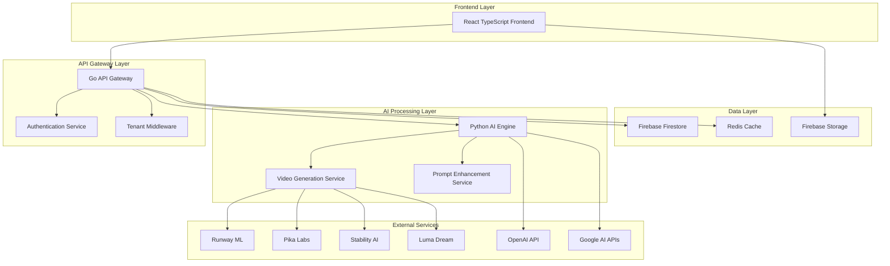

# CeaserAdvtGenius - Developer Documentation

## Table of Contents

- [Project Overview](#project-overview)
- [Architecture](#architecture)
- [Development Environment Setup](#development-environment-setup)
- [Services Overview](#services-overview)
- [API Documentation](#api-documentation)
- [Database Schema](#database-schema)
- [Deployment](#deployment)
- [Testing](#testing)
- [Contributing Guidelines](#contributing-guidelines)
- [Troubleshooting](#troubleshooting)
- [Future Roadmap](#future-roadmap)

## Project Overview

**CeaserAdvtGenius** is a professional-grade, multi-tenant SaaS platform that leverages polyglot microservices architecture to deliver AI-powered advertising creative generation and analytics. The platform combines the operational performance of Go with the AI capabilities of Python to create a scalable, enterprise-ready solution.

### Key Features

- **AI-Powered Content Generation**: Advanced creative generation using multiple AI providers (OpenAI, Google, Runway, Pika, etc.)
- **Multi-Provider Video Generation**: 6 video generation models including Runway Gen-3, Pika v2, Stability SVD
- **Multi-Tenant Architecture**: Secure data isolation with Firebase Firestore and tenant context management
- **Real-Time Analytics**: Comprehensive performance tracking and optimization insights
- **Polyglot Microservices**: Go API Gateway + Python AI Engine for optimal performance
- **Modern UI**: React 18 + Material-UI with responsive design and dark/light themes
- **Enterprise-Ready**: Production-ready with Docker containerization and cloud-native design

### Project Structure

```
ceaser-ad-business/
├── docs/                           # Project documentation
│   └── ThoughtOfProject/           # Architectural blueprints and design documents
├── frontend/                       # React TypeScript frontend
├── services/
│   ├── go-api-gateway/            # Go-based API gateway service
│   └── python-ai-engine/          # Python-based AI processing service
├── firebase/                       # Firebase configuration and setup
├── docker-compose.dev.yaml        # Development environment
├── docker-compose.prod.yaml       # Production environment
├── Makefile                        # Build and deployment automation
└── README.md                       # Project overview
```

## Architecture

### System Architecture Overview

CeaserAdvtGenius implements a **polyglot microservices architecture** that leverages the strengths of different technologies:



### Design Principles

1. **Polyglot Architecture**: Each service uses the optimal technology for its domain
2. **Multi-Tenancy**: Database-per-tenant isolation for security and scalability
3. **Microservices**: Loose coupling with high cohesion within service boundaries
4. **API-First**: RESTful APIs with comprehensive documentation
5. **Cloud-Native**: Containerized, stateless, and horizontally scalable
6. **Security by Design**: Authentication, authorization, and data isolation

### Service Communication

- **Frontend ↔ Go Gateway**: HTTP/REST APIs with JSON payloads
- **Go Gateway ↔ Python AI**: gRPC for high-performance inter-service communication
- **Caching**: Redis for session management and performance optimization
- **Database**: Firebase Firestore for multi-tenant data storage
- **File Storage**: Firebase Storage for media assets

## Development Environment Setup

### Prerequisites

- **Docker & Docker Compose**: For containerized development
- **Node.js 18+**: For frontend development
- **Go 1.21+**: For Go API Gateway development
- **Python 3.12+**: For AI Engine development
- **Firebase CLI**: For Firebase integration
- **Make**: For build automation

### Quick Start

1. **Clone the repository**:

   ```bash
   git clone <repository-url>
   cd ceaser-ad-business
   ```

2. **Environment Configuration**:

   ```bash
   # Copy environment templates
   cp services/go-api-gateway/.env.example services/go-api-gateway/.env
   cp services/python-ai-engine/.env.example services/python-ai-engine/.env
   cp frontend/firebase/.env.example frontend/firebase/.env
   ```

3. **Firebase Setup**:

   ```bash
   # Follow Firebase setup guide
   cd firebase
   ./setup-firebase.sh
   ```

4. **Start Development Environment**:

   ```bash
   # Start all services
   make dev-up

   # Or manually with Docker Compose
   docker-compose -f docker-compose.dev.yaml up
   ```

5. **Access the Application**:
   - Frontend: http://localhost:5173
   - Go API Gateway: http://localhost:8080
   - Python AI Engine: http://localhost:8081

### Manual Development Setup

#### Go API Gateway

```bash
cd services/go-api-gateway
go mod download
go run cmd/main.go
```

#### Python AI Engine

```bash
cd services/python-ai-engine
python -m venv venv
source venv/bin/activate  # On Windows: venv\Scripts\activate
pip install -r requirements.txt
python main.py
```

#### Frontend

```bash
cd frontend
npm install
npm run dev
```

## Services Overview

### 1. Go API Gateway (`services/go-api-gateway/`)

**Purpose**: High-performance operational plane handling HTTP requests, database operations, and request orchestration.

**Key Components**:

- **HTTP Handlers**: RESTful API endpoints for all client operations
- **Tenant Service**: Multi-tenant database management and lifecycle
- **Redis Service**: Comprehensive caching with multiple strategies
- **Ad Generation Service**: Campaign and creative management with AI delegation
- **Analytics Service**: Performance tracking, trend analysis, and insights
- **Billing Service**: Subscription management, usage tracking, and invoicing

**Technologies**:

- Go 1.21+
- Gorilla Mux for routing
- gRPC client for Python AI communication
- Firebase Admin SDK
- Redis for caching

**Key Files**:

```
cmd/main.go                    # Application entry point
internal/
├── handlers/                  # HTTP request handlers
├── services/                  # Business logic services
├── middleware/                # Request middleware
├── models/                    # Data models
└── config/                    # Configuration management
proto/                         # gRPC protocol definitions
```

### 2. Python AI Engine (`services/python-ai-engine/`)

**Purpose**: Advanced AI reasoning plane using LangChain for complex agentic workflows and creative generation.

**Key Components**:

- **Creative Service**: AI-powered content generation orchestration
- **Video Generation Service**: Multi-provider video generation (6 providers)
- **Prompt Service**: Intelligent prompt enhancement and quantification
- **Provider Adapters**: Integration with external AI services

**Technologies**:

- Python 3.12
- LangChain for LLM orchestration
- gRPC server for Go communication
- AsyncIO for concurrent processing
- Structlog for structured logging

**Key Files**:

```
main.py                        # gRPC server entry point
app/
├── services/
│   ├── creative_service.py    # Main creative generation orchestrator
│   ├── video_generation.py    # Multi-provider video generation
│   └── prompt_service.py      # Prompt enhancement and quantification
├── models/                    # Data models and schemas
└── utils/                     # Utility functions
proto/                         # gRPC protocol definitions
```

**Video Generation Providers**:

- Runway Gen-3 Turbo
- Pika v2
- Stability Video Diffusion
- Luma Dream Machine
- Google Veo
- OpenAI Sora (shorts)

### 3. Frontend (`frontend/`)

**Purpose**: Modern, responsive web application with Material-UI components.

**Key Components**:

- **Authentication**: Firebase Auth integration
- **Dashboard**: Campaign management and analytics
- **Creative Studio**: AI-powered content generation interface
- **Analytics**: Performance tracking and insights
- **Billing**: Subscription and usage management

**Technologies**:

- React 18
- TypeScript
- Material-UI v5
- Vite for build tooling
- Firebase SDK

**Key Files**:

```
src/
├── components/                # Reusable UI components
├── pages/                     # Application pages
├── contexts/                  # React contexts (Auth, Theme)
├── hooks/                     # Custom React hooks
├── services/                  # API service layer
├── store/                     # State management
├── theme/                     # Material-UI theme configuration
└── types/                     # TypeScript type definitions
```

## API Documentation

### Base Configuration

- **Base URL**: `http://localhost:8080/api/v1`
- **Authentication**: Bearer token (JWT in production)
- **Content-Type**: `application/json`

### Multi-Tenant Headers

```http
X-Tenant-ID: your-tenant-id
Authorization: Bearer your-jwt-token
```

### Core Endpoints

#### Health Check

```http
GET /health
```

#### Authentication

```http
POST /auth/login
POST /auth/register
POST /auth/refresh
```

#### Campaigns

```http
GET    /campaigns                    # List campaigns
POST   /campaigns                    # Create campaign
GET    /campaigns/{id}               # Get campaign
PUT    /campaigns/{id}               # Update campaign
DELETE /campaigns/{id}               # Delete campaign
```

#### Creatives

```http
GET    /campaigns/{id}/creatives     # List creatives
POST   /campaigns/{id}/creatives     # Generate creative
GET    /creatives/{id}               # Get creative
PUT    /creatives/{id}               # Update creative
DELETE /creatives/{id}               # Delete creative
```

#### Video Generation

```http
GET    /video/models                 # List available video models
POST   /video/generate               # Generate video content
```

#### Analytics

```http
GET    /analytics/campaigns/{id}     # Campaign analytics
GET    /analytics/creatives/{id}     # Creative performance
GET    /analytics/overview           # Dashboard overview
```

For detailed API documentation with examples, see:

- [Complete API Documentation](docs/API_DOCUMENTATION.md)
- [Video Generation Implementation Guide](docs/VIDEO_GENERATION_IMPLEMENTATION.md)

## Database Schema

### Firestore Collections

#### Tenants

```javascript
tenants/{tenantId}
{
  name: string,
  domain: string,
  plan: string,
  settings: object,
  createdAt: timestamp,
  updatedAt: timestamp
}
```

#### Campaigns

```javascript
tenants/{tenantId}/campaigns/{campaignId}
{
  name: string,
  description: string,
  status: string,
  budget: number,
  targetAudience: object,
  createdAt: timestamp,
  updatedAt: timestamp
}
```

#### Creatives

```javascript
tenants/{tenantId}/creatives/{creativeId}
{
  campaignId: string,
  type: string, // 'text', 'image', 'video'
  content: object,
  prompt: string,
  model: string,
  metadata: object,
  performance: object,
  createdAt: timestamp
}
```

#### Analytics

```javascript
tenants/{tenantId}/analytics/{date}
{
  campaignId: string,
  creativeId: string,
  impressions: number,
  clicks: number,
  conversions: number,
  cost: number,
  timestamp: timestamp
}
```

## Deployment

### Development Deployment

```bash
# Start all services
make dev-up

# Stop all services
make dev-down

# View logs
make dev-logs
```

### Production Deployment

```bash
# Build production images
make prod-build

# Deploy to production
make prod-deploy

# Monitor production
make prod-logs
```

### Environment Variables

#### Go API Gateway

```bash
PORT=8080
FIREBASE_PROJECT_ID=your-project-id
REDIS_URL=redis://localhost:6379
PYTHON_AI_ENGINE_URL=localhost:8081
LOG_LEVEL=info
```

#### Python AI Engine

```bash
PORT=8081
OPENAI_API_KEY=your-openai-key
GOOGLE_API_KEY=your-google-key
RUNWAY_API_KEY=your-runway-key
PIKA_API_KEY=your-pika-key
STABILITY_API_KEY=your-stability-key
LUMA_API_KEY=your-luma-key
LOG_LEVEL=info
```

#### Frontend

```bash
VITE_FIREBASE_API_KEY=your-firebase-api-key
VITE_FIREBASE_AUTH_DOMAIN=your-project.firebaseapp.com
VITE_FIREBASE_PROJECT_ID=your-project-id
VITE_API_BASE_URL=http://localhost:8080
```

## Testing

### Unit Testing

#### Go API Gateway

```bash
cd services/go-api-gateway
go test ./...
```

#### Python AI Engine

```bash
cd services/python-ai-engine
python -m pytest
```

#### Frontend

```bash
cd frontend
npm test
```

### Integration Testing

#### Postman Collection Testing

**Quick Setup (5 minutes)**:

1. **Import Collection & Environment**:

   - Open Postman
   - Import Collection: `services/go-api-gateway/AdGenius_API_Collection.postman_collection.json`
   - Import Environment: `services/go-api-gateway/AdGenius_Local_Environment.postman_environment.json`
   - Select "AdGenius Local Development" environment

2. **Start Services**:

   ```bash
   # Terminal 1: Start Go API Gateway
   cd services/go-api-gateway
   cp .env.example .env
   go run cmd/main.go

   # Terminal 2: Start Python AI Engine
   cd services/python-ai-engine
   python main.py
   ```

3. **Run Test Suite**:
   - Open imported collection in Postman
   - Click "Run collection"
   - Execute all 25+ automated tests
   - Verify all tests pass

**Available Test Categories**:

- Health checks and system status
- Authentication and authorization
- Campaign management (CRUD operations)
- Creative generation with AI integration
- Analytics and performance tracking
- Billing and subscription management
- Multi-tenant data isolation
- Error handling and edge cases

#### Video Generation Testing

```bash
cd services/python-ai-engine
./scripts/run_test.sh
```

### End-to-End Testing

```bash
# Start all services
make dev-up

# Run E2E tests
make test-e2e
```

## Contributing Guidelines

### Code Standards

#### Go

- Use `gofmt` for formatting
- Follow Go naming conventions
- Write comprehensive tests
- Use context for cancellation
- Handle errors explicitly

#### Python

- Follow PEP 8 style guide
- Use type hints
- Write docstrings for all functions
- Use structured logging
- Handle async operations properly

#### TypeScript/React

- Use TypeScript strict mode
- Follow React best practices
- Use functional components with hooks
- Write unit tests for components
- Use Material-UI components consistently

### Git Workflow

1. Create feature branch from `main`
2. Make atomic commits with clear messages
3. Write tests for new functionality
4. Update documentation
5. Create pull request
6. Ensure CI passes
7. Get code review approval
8. Merge to main

### Branch Naming

- `feature/description-of-feature`
- `bugfix/description-of-bug`
- `docs/description-of-docs-change`
- `refactor/description-of-refactor`

## Troubleshooting

### Common Issues

#### Docker Build Issues

```bash
# Clean Docker cache
docker system prune -a

# Rebuild without cache
docker-compose build --no-cache
```

#### Port Conflicts

```bash
# Check port usage
lsof -i :8080
lsof -i :8081
lsof -i :5173

# Kill processes
kill -9 <PID>
```

#### Firebase Connection Issues

```bash
# Verify Firebase credentials
firebase projects:list

# Re-authenticate
firebase login

# Check service account
cat firebase/service-account.json
```

#### Python Virtual Environment Issues

```bash
# Recreate virtual environment
cd services/python-ai-engine
rm -rf venv
python -m venv venv
source venv/bin/activate
pip install -r requirements.txt
```

### Debugging

#### Go API Gateway

```bash
# Enable debug logging
export LOG_LEVEL=debug

# Run with debugger
dlv debug cmd/main.go
```

#### Python AI Engine

```bash
# Enable debug logging
export LOG_LEVEL=debug

# Run with debugger
python -m pdb main.py
```

#### Frontend

```bash
# Enable debug mode
npm run dev -- --debug

# Inspect React components
# Use React Developer Tools browser extension
```

### Performance Monitoring

#### Application Metrics

- Request latency
- Error rates
- Memory usage
- CPU utilization

#### Business Metrics

- Creative generation throughput
- API response times
- User engagement
- System availability

## Future Roadmap

### Short Term (Next 3 months)

- [ ] Enhanced video generation with custom parameters
- [ ] Real-time collaboration features
- [ ] Advanced analytics dashboard
- [ ] Mobile responsive improvements
- [ ] API rate limiting and quotas

### Medium Term (3-6 months)

- [ ] Machine learning model optimization
- [ ] Advanced prompt engineering
- [ ] Multi-language support
- [ ] Third-party integrations (Facebook, Google Ads)
- [ ] Enterprise SSO integration

### Long Term (6+ months)

- [ ] Custom AI model training
- [ ] Advanced video editing capabilities
- [ ] Automated A/B testing
- [ ] Predictive analytics
- [ ] White-label solutions

### Technical Debt

- [ ] Migrate to Kubernetes for orchestration
- [ ] Implement comprehensive monitoring
- [ ] Add automated security scanning
- [ ] Improve test coverage to 90%+
- [ ] Performance optimization

## Support

### Documentation

- Architecture documentation: `docs/ThoughtOfProject/`
- API documentation: `docs/API_DOCUMENTATION.md`
- Video generation guide: `docs/VIDEO_GENERATION_IMPLEMENTATION.md`

### Development Support

- Check existing issues in project repository
- Review troubleshooting section above
- Consult team documentation in `docs/ThoughtOfProject/`

### Production Support

- Monitor application logs
- Check system health endpoints
- Review performance metrics
- Follow incident response procedures

---

_This documentation is maintained by the CeaserAdvtGenius development team. Last updated: August 12, 2025_
