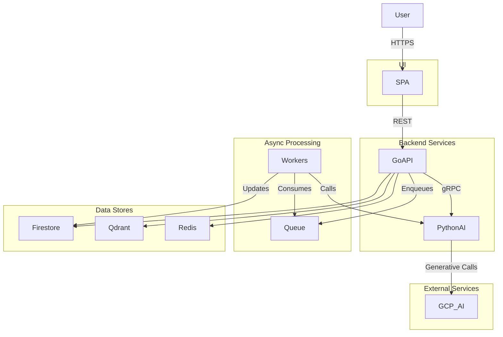

# AdGenius - AI-Powered Advertising Platform

A professional-grade, multi-tenant SaaS platform that leverages modern polyglot microservices architecture to deliver AI-powered advertising creative generation and analytics.

## 🚀 Features

- **AI-Powered Content Generation**: Advanced creative generation using OpenAI GPT-4, Google Gemini, and other LLMs
- **Multi-Tenant Architecture**: Secure data isolation with Firebase Firestore and tenant context management
- **Real-Time Analytics**: Comprehensive performance tracking and optimization insights
- **Polyglot Microservices**: Go API Gateway + Python AI Engine for optimal performance
- **Modern UI**: React 18 + Material-UI with responsive design and dark/light themes
- **Enterprise-Ready**: Production-ready with Docker containerization and cloud-native design

## 🏗️ Architecture Overview

This project implements a **polyglot microservices architecture** that leverages the strengths of different technologies:

- **Go API Gateway**: High-performance operational plane handling HTTP requests, database operations, and request orchestration
- **Python AI Engine**: Advanced AI reasoning plane using LangChain for complex agentic workflows and creative generation
- **React Frontend**: Modern, responsive web application with Material-UI components
- **Firebase Services**: Cloud-native authentication and Firestore database
- **gRPC Communication**: High-performance inter-service communication

### System Architecture



```text
┌─────────────────┐    ┌──────────────────┐    ┌─────────────────┐
│                 │    │                  │    │                 │
│   Frontend      │    │   Go API         │    │   Python AI     │
│   (React)       │◄──►│   Gateway        │◄──►│   Engine        │
│   Port: 3000    │    │   Port: 8080     │    │   Port: 50051   │
│                 │    │                  │    │   (gRPC)        │
└─────────────────┘    └──────────────────┘    └─────────────────┘
                              │                          │
                              ▼                          ▼
                    ┌─────────────────┐      ┌─────────────────┐
                    │                 │      │                 │
                    │ Firebase        │      │  Redis Cloud    │
                    │ (Auth/Firestore)│      │  (Cache/Queue)  │
                    │                 │      │                 │
                    └─────────────────┘      └─────────────────┘
```

## 📁 Project Structure

```
ceaser-ad-business/
├── frontend/                   # React TypeScript frontend
│   ├── src/
│   │   ├── components/         # Reusable UI components
│   │   ├── pages/             # Page components
│   │   ├── services/          # API service layer
│   │   ├── contexts/          # React contexts (Auth, Theme)
│   │   └── types/             # TypeScript type definitions
│   ├── public/                # Static assets
│   ├── package.json
│   └── Dockerfile.dev
├── services/
│   ├── go-api-gateway/        # Go API Gateway Service
│   │   ├── cmd/
│   │   │   └── main.go        # Application entry point
│   │   ├── internal/
│   │   │   ├── handlers/      # HTTP request handlers
│   │   │   ├── middleware/    # CORS, Auth, Tenant middleware
│   │   │   ├── database/      # Firebase Firestore client
│   │   │   └── grpc/          # gRPC client for AI Engine
│   │   ├── go.mod
│   │   ├── Dockerfile
│   │   └── .env
│   └── python-ai-engine/      # Python AI Engine Service
│       ├── app/
│       │   ├── services/      # AI service implementations
│       │   ├── agents/        # LangChain agents
│       │   └── models/        # Data models
│       ├── proto/             # Generated protobuf files
│       ├── main.py            # gRPC server entry point
│       ├── requirements.txt
│       ├── Dockerfile
│       └── .env
├── firebase/
│   └── service-account.json   # Firebase service account (not in repo)
├── docs/                      # Documentation
├── docker-compose.dev.yaml    # Development environment
├── docker-compose.prod.yaml   # Production environment
├── Makefile                   # Development commands
├── setup.sh                   # Automated setup script
└── status-check.sh            # Health check script
```

## 🛠️ Quick Start

### Prerequisites

- **Docker & Docker Compose** (latest version)
- **Node.js 18+** (for local frontend development)
- **Go 1.24+** (for local Go development)
- **Python 3.12+** (for local AI engine development)
- **Firebase Account** (for authentication and database)

### 1. Environment Setup

#### Firebase Configuration

1. Create a Firebase project at [Firebase Console](https://console.firebase.google.com/)
2. Enable Authentication and Firestore Database
3. Generate a service account key and save as `firebase/service-account.json`
4. Get your Firebase configuration from Project Settings

#### Environment Variables

```bash
# Create environment files from templates
cp frontend/.env.example frontend/.env.local
cp services/go-api-gateway/.env.example services/go-api-gateway/.env
cp services/python-ai-engine/.env.example services/python-ai-engine/.env
```

Update the environment files with your actual values:

**Frontend (.env.local)**:

```env
VITE_API_BASE_URL=http://localhost:8080
VITE_FIREBASE_API_KEY=your-firebase-api-key
VITE_FIREBASE_AUTH_DOMAIN=your-project.firebaseapp.com
VITE_FIREBASE_PROJECT_ID=your-project-id
```

**Go API Gateway (.env)**:

```env
PORT=8080
FIREBASE_PROJECT_ID=your-project-id
GOOGLE_APPLICATION_CREDENTIALS=/app/firebase/service-account.json
AI_ENGINE_GRPC_ADDRESS=python-ai-engine:50051
```

**Python AI Engine (.env)**:

```env
GRPC_PORT=50051
OPENAI_API_KEY=your-openai-api-key
GOOGLE_API_KEY=your-google-api-key
FIREBASE_PROJECT_ID=your-project-id
```

### 2. Docker Development Setup

The fastest way to get started is using Docker Compose:

```bash
# Start all services
docker compose -f docker-compose.dev.yaml up -d

# View logs
docker compose -f docker-compose.dev.yaml logs -f

# Check service health
./status-check.sh
```

**Service URLs:**

- **Frontend**: <http://localhost:3000>
- **API Gateway**: <http://localhost:8080>
- **Health Check**: <http://localhost:8080/health>

### 3. Local Development

For local development with hot reload:

#### Terminal 1: Start AI Engine

```bash
cd services/python-ai-engine
python -m venv venv
source venv/bin/activate  # On Windows: venv\Scripts\activate
pip install -r requirements.txt
python main.py
```

#### Terminal 2: Start API Gateway

```bash
cd services/go-api-gateway
go mod download
go run cmd/main.go
```

#### Terminal 3: Start Frontend

```bash
cd frontend
npm install
npm run dev
```

## 🔧 Development Commands

The project includes a comprehensive Makefile for common development tasks:

```bash
# View all available commands
make help

# Start all services with Docker
make start

# Stop all services
make stop

# View service logs
make logs

# Check service health
make health

# Run tests
make test

# Clean up containers and volumes
make clean
```

## 🌐 API Endpoints

### Go API Gateway (Port 8080)

The Go API Gateway provides a unified REST API interface for all frontend interactions.

#### Health & Status

- `GET /health` - Service health check
- `GET /status` - Detailed service status

#### Campaign Management

- `GET /api/v1/campaigns` - List campaigns with pagination
- `POST /api/v1/campaigns` - Create new campaign
- `GET /api/v1/campaigns/:id` - Get campaign details
- `PUT /api/v1/campaigns/:id` - Update campaign
- `DELETE /api/v1/campaigns/:id` - Delete campaign

#### Creative Management

- `GET /api/v1/creatives` - List creatives with filtering
- `POST /api/v1/creatives` - Create new creative
- `GET /api/v1/creatives/:id` - Get creative details
- `PUT /api/v1/creatives/:id` - Update creative
- `DELETE /api/v1/creatives/:id` - Delete creative

#### AI-Powered Features (Proxy to Python AI Engine)

- `POST /api/v1/creatives/generate` - Generate creative with AI
- `POST /api/v1/analytics/insights` - Generate performance insights
- `POST /api/v1/agent/workflow` - Execute AI agent workflow
- `POST /api/v1/campaigns/analyze` - AI-powered campaign analysis

#### Analytics

- `GET /api/v1/analytics/campaigns/:id` - Campaign performance metrics
- `GET /api/v1/analytics/summary` - Performance summary dashboard
- `GET /api/v1/analytics/top-creatives` - Best performing creatives

### Python AI Engine (gRPC Port 50051)

The Python AI Engine provides advanced AI capabilities via gRPC.

## 🤖 AI Features

### Creative Generation Service

- **Multi-modal Content**: Text, images, videos, carousel ads
- **LangChain Integration**: Advanced prompt engineering and chains
- **Multiple LLM Support**: OpenAI GPT-4, Google Gemini, Azure OpenAI
- **Brand-Aware Generation**: Considers brand guidelines and audience targeting

### Analysis Service

- **Performance Analysis**: Deep insights into campaign effectiveness
- **Audience Segmentation**: Behavioral analysis and targeting recommendations
- **Creative Optimization**: A/B testing insights and performance predictions
- **Competitive Intelligence**: Market analysis and positioning recommendations

### Agent Service (LangChain Agents)

- **Research Agents**: Automated market research with web search capabilities
- **Optimization Agents**: Budget allocation and bid optimization
- **Content Agents**: Automated content ideation and creation workflows
- **Analytics Agents**: Advanced data analysis and reporting

## 🏢 Multi-Tenant Architecture

### Firebase Firestore Collections

- **tenants**: Tenant configuration and metadata
- **campaigns**: Campaign data organized by tenant
- **creatives**: Creative content with tenant isolation
- **analytics**: Performance metrics with tenant separation
- **users**: User profiles and permissions per tenant

### Tenant Context Management

- **Header-Based**: `X-Tenant-ID` header in API requests
- **Subdomain**: `tenant.adgenius.com` routing (future)
- **Firebase Rules**: Security rules enforce tenant data isolation

  ```bash
  python -m venv .venv
  source .venv/bin/activate  # On Windows: .venv\Scripts\activate
  ```

3. **Install dependencies**:

   ```bash
   pip install pip-tools
   pip-compile requirements.in
   pip install -r requirements.txt
   ```

4. **Run migrations**:

   ```bash
   python manage.py migrate
   ```

5. **Start development server**:
   ```bash
   python manage.py runserver
   ```

#### Frontend Setup

1. **Navigate to frontend directory**:

   ```bash
   cd frontend
   ```

2. **Install dependencies**:

   ```bash
   npm install
   ```

3. **Start development server**:
   ```bash
   npm run dev
   ```

## 📚 API Documentation

The API is documented using OpenAPI 3.0 specification. Access the interactive documentation at:

- **ReDoc**: http://localhost:8080/api/docs/
- **Schema**: http://localhost:8080/api/schema/

## 🛠️ Technology Stack

### Frontend

- **React 18** - Modern React with hooks and concurrent features
- **TypeScript** - Type-safe development
- **Material-UI (MUI)** - Professional UI components with Material Design 3
- **Vite** - Fast build tool and development server
- **React Router v6** - Client-side routing
- **React Query** - Server state management
- **React Hook Form** - Form validation and management

### Backend Services

- **Go 1.24** - High-performance API Gateway
  - Gin Framework - Fast HTTP router
  - Firebase Admin SDK - Authentication and Firestore
  - gRPC Client - Communication with AI Engine
  - OpenTelemetry - Observability and tracing
- **Python 3.12** - AI Engine
  - LangChain - AI agent frameworks
  - OpenAI & Google APIs - LLM integrations
  - gRPC Server - High-performance RPC
  - FastAPI - Additional HTTP endpoints

### Data & Infrastructure

- **Firebase Firestore** - NoSQL document database with multi-tenant support
- **Firebase Authentication** - User management and JWT tokens
- **Redis Cloud** - Caching and session storage
- **Docker & Docker Compose** - Containerization
- **Protocol Buffers** - Type-safe service contracts

### AI & ML

- **OpenAI GPT-4** - Advanced language model
- **Google Gemini** - Multimodal AI capabilities
- **LangChain** - AI agent and workflow orchestration
- **Custom Agents** - Specialized business logic

## 📈 Performance Benefits

### Go API Gateway Advantages

- **High Concurrency**: Goroutines handle thousands of concurrent requests
- **Low Latency**: Compiled binary with minimal overhead
- **Efficient I/O**: Optimized for database and network operations
- **Small Memory Footprint**: Ideal for containerized deployments

### Python AI Engine Advantages

- **Rich AI Ecosystem**: Full access to LangChain, OpenAI, and ML libraries
- **Rapid Development**: Quick iteration on AI features and experiments
- **Advanced Tooling**: Extensive library ecosystem for data science
- **Complex Reasoning**: Sophisticated agentic workflows and decision-making

### gRPC Communication Benefits

- **Binary Protocol**: More efficient than JSON/REST for service communication
- **Type Safety**: Strongly typed service contracts with Protocol Buffers
- **Multiplexing**: Multiple requests over single connection
- **Backward Compatibility**: Schema evolution support

## 🔄 Inter-Service Communication

### Request Flow Example

1. **Frontend** sends HTTP request to **Go API Gateway**
2. **Go Service** validates request, checks authentication via Firebase
3. **Go Service** fetches/stores data in **Firestore**
4. For AI operations, **Go Service** calls **Python AI Engine** via **gRPC**
5. **Python Service** processes using **LangChain** and **LLMs**
6. **Python Service** returns results via **gRPC**
7. **Go Service** formats response and returns to **Frontend**

### Authentication Flow

1. User authenticates via **Firebase Auth** in frontend
2. Frontend receives **Firebase ID Token**
3. All API requests include **Bearer Token** in Authorization header
4. **Go API Gateway** validates token with **Firebase Admin SDK**
5. Valid requests proceed with user context attached

## � Deployment Options

### Development Environment

```bash
# Local development with hot reload
make dev-go      # Terminal 1: Go API Gateway
make dev-python  # Terminal 2: Python AI Engine
make dev-frontend # Terminal 3: React Frontend
```

### Docker Development

```bash
# Full stack with Docker Compose
docker compose -f docker-compose.dev.yaml up -d
```

### Production Deployment

```bash
# Production-ready containers
docker compose -f docker-compose.prod.yaml up -d
```

### Cloud Deployment (Future)

## 🔒 Security & Authentication

### Firebase Authentication

- **JWT Tokens**: Firebase ID tokens for secure API access
- **Multi-Provider**: Email/password, Google OAuth, GitHub OAuth
- **Token Validation**: Server-side verification with Firebase Admin SDK
- **Session Management**: Secure cookie-based sessions

### Data Security

- **Tenant Isolation**: Firestore security rules enforce data separation
- **Input Validation**: Comprehensive request validation and sanitization
- **Rate Limiting**: API request throttling and abuse protection
- **HTTPS Only**: TLS encryption for all communications

## � Monitoring & Observability

### Health Checks

```bash
# Check all services
./status-check.sh

# Individual service health
curl http://localhost:8080/health  # API Gateway
curl http://localhost:3000         # Frontend
```

### Logging

- **Structured Logging**: JSON format for easy parsing
- **Log Levels**: Debug, Info, Warn, Error with configurable levels
- **Request Tracing**: Track requests across services
- **Error Tracking**: Comprehensive error reporting

### Metrics (Future)

- **Prometheus**: Metrics collection and alerting
- **Grafana**: Visualization dashboards
- **Jaeger**: Distributed tracing
- **Custom Metrics**: Business KPIs and performance indicators

## 🧪 Testing

### Unit Tests

```bash
# Go API Gateway
cd services/go-api-gateway
go test ./...

# Python AI Engine
cd services/python-ai-engine
python -m pytest

# Frontend
cd frontend
npm test
```

### Integration Tests

```bash
# End-to-end Docker testing
docker compose -f docker-compose.dev.yaml up -d
./status-check.sh
```

## 🔧 Troubleshooting

### Common Issues

1. **Services not starting**

   ```bash
   # Check Docker status
   docker ps

   # View service logs
   docker compose -f docker-compose.dev.yaml logs -f
   ```

2. **gRPC connection failures**

   ```bash
   # Verify AI Engine is running
   docker ps | grep python-ai-engine

   # Check gRPC port
   netstat -an | grep 50051
   ```

3. **Firebase connection issues**

   ```bash
   # Verify service account file exists
   ls -la firebase/service-account.json

   # Check environment variables
   docker compose exec go-api-gateway env | grep FIREBASE
   ```

4. **Frontend API calls failing**
   ```bash
   # Check CORS configuration
   curl -H "Origin: http://localhost:3000" \
        -H "Access-Control-Request-Method: GET" \
        -X OPTIONS http://localhost:8080/health
   ```

### Performance Optimization

1. **Go Service Optimization**

   - Adjust Firestore connection pool size
   - Configure goroutine limits
   - Enable HTTP/2 for better multiplexing

2. **Python Service Optimization**

   - Increase gRPC worker threads
   - Configure LangChain caching
   - Optimize LLM token usage

3. **Frontend Optimization**
   - Enable React production build
   - Configure service worker caching
   - Optimize bundle size with code splitting

## 🤝 Contributing

We welcome contributions! Please follow these guidelines:

### Development Setup

```bash
# Clone and setup
git clone <repository-url>
cd ceaser-ad-business
./setup.sh

# Start development environment
make dev-go      # Terminal 1
make dev-python  # Terminal 2
make dev-frontend # Terminal 3
```

### Code Standards

- **Go**: `gofmt`, `golint`, comprehensive tests
- **Python**: `black`, `flake8`, `mypy` type checking
- **TypeScript**: `prettier`, `eslint`, strict TypeScript config
- **Commits**: Conventional Commits format

### Pull Request Process

1. Fork the repository
2. Create a feature branch (`feature/amazing-feature`)
3. Write tests for new functionality
4. Ensure all tests pass and linting succeeds
5. Update documentation as needed
6. Submit a pull request with clear description

## 📚 Additional Resources

- **[Firebase Setup Guide](FIREBASE_SETUP.md)** - Detailed Firebase configuration
- **[Project Status](PROJECT_STATUS.md)** - Current development status
- **[Architecture Docs](docs/)** - Detailed technical documentation
- **[API Documentation](services/go-api-gateway/README.md)** - Go API Gateway docs
- **[AI Engine Docs](services/python-ai-engine/README.md)** - Python AI Engine docs

## 📝 License

This project is licensed under the MIT License - see the [LICENSE](LICENSE) file for details.

## 🆘 Support & Community

- **GitHub Issues**: [Report bugs and request features](https://github.com/your-org/ceaser-ad-business/issues)
- **Documentation**: Comprehensive guides in the `docs/` directory
- **Development Chat**: Join our development discussions
- **Email Support**: <support@adgenius.com>

---

Built with ❤️ using modern polyglot microservices architecture. This project represents a strategic approach to building scalable, high-performance AI applications by leveraging the unique strengths of Go and Python in a cloud-native environment. 🚀

- 📋 A/B testing framework
- 📋 Billing and subscriptions

### Phase 3 (Q3 2024)

- 📋 Real-time collaboration
- 📋 API for third-party integrations
- 📋 Advanced analytics and insights
- 📋 Mobile application

---

Built with ❤️ by the AdGenius Team
