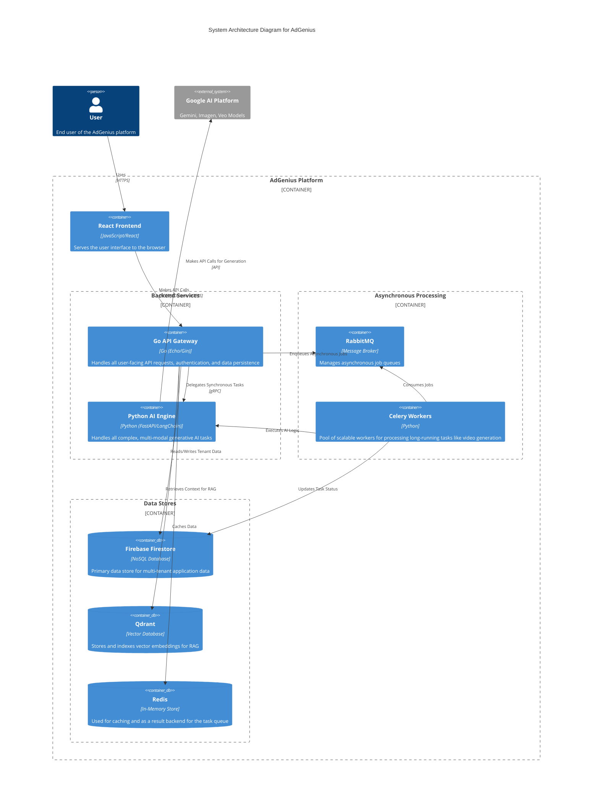
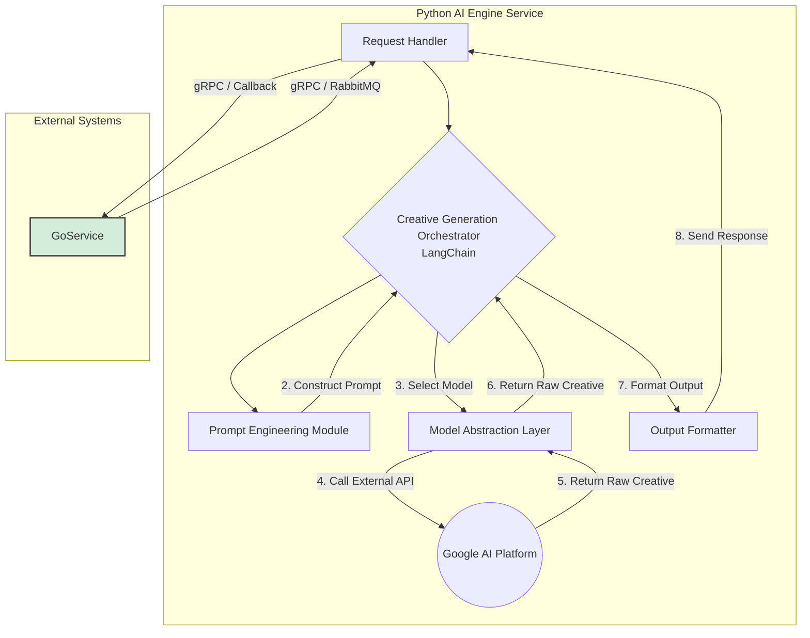
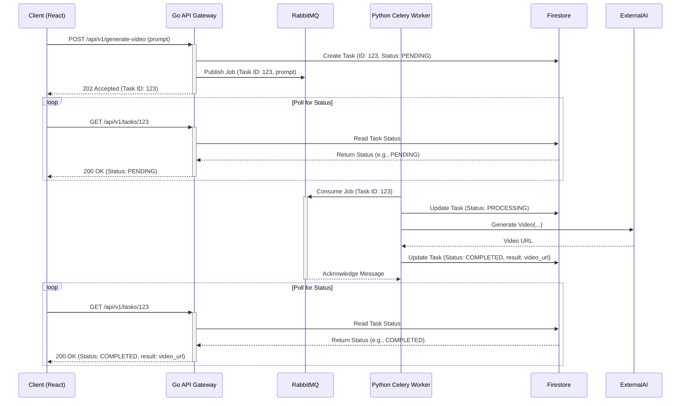

# **Architectural Blueprint for "AdGenius": A Polyglot Generative AI Advertising Platform**

## **Section 1: Strategic Context and Platform Vision**

This document outlines the complete technical and architectural blueprint for the development of "AdGenius," a professional-grade, multi-tenant Software-as-a-Service (SaaS) platform. The platform is designed to leverage the cutting-edge capabilities of Google's Generative AI stack, including the Gemini family of models, to empower businesses with the ability to create high-performance advertising creatives on demand, with a primary focus on multi-modal content including text, images, and video.

This unified document synthesizes previous architectural decisions, establishing a definitive plan that incorporates a high-performance polyglot backend, a modular AI engine, and a modern, innovative user interface, all designed to operate at extreme scale.

### **1.1 The Generative AI Revolution in Advertising**

The digital advertising market is undergoing a fundamental transformation, driven by the maturation of artificial intelligence. AI is rapidly evolving from a supplementary tool for task automation into a core strategic component for competitive marketing.\[1\] The industry is moving beyond using AI for simple workflow enhancements towards leveraging it for hyper-personalized marketing campaigns executed at an unprecedented scale.\[1, 2\] This shift represents a new paradigm where AI is a necessity for achieving market relevance and efficiency.\[3\]

Market data indicates widespread and accelerating adoption. Over 80% of advertisers have already incorporated some form of AI-powered tooling into their workflows, with a notable surge in demand from small to mid-sized businesses (SMBs).\[4\]

AdGenius is architected to capitalize on this trend by providing a platform that automates and elevates the entire creative process. It will utilize Generative AI to handle the mechanics of copywriting, image production, and video generation, which are often the most time-consuming aspects of campaign development.\[3\] This automation frees marketers to concentrate on higher-value strategic work.\[5\] Beyond simple content generation, the platform will deliver sophisticated, data-driven insights by analyzing vast datasets in real-time to identify market trends, understand audience sentiment, and optimize campaign performance.\[1, 6\]

### **1.2 Platform Value Proposition: "AdGenius"**

The core mission of AdGenius is to democratize access to high-end, data-driven creative advertising. It will provide a scalable, intuitive, and cost-effective SaaS platform that empowers businesses of all sizes to generate on-brand, high-performing ad creatives using the advanced capabilities of Google's Gemini AI models.\[7, 2\]

The platform's value is defined by several key differentiators:

- **Hyper-Personalization at Scale:** The platform will move beyond generic templates. By interpreting nuanced user prompts and analyzing behavioral data, AdGenius will generate truly personalized ad copy, images, and videos tailored to specific audience segments.\[1, 2, 8\]
- **Efficiency and Speed-to-Market:** AdGenius will fundamentally accelerate the creative lifecycle. By automating content generation, the platform will drastically reduce creative development timeframes, with early adopters of similar technologies reporting reductions in time-to-market of up to 50%.\[9\]
- **Multi-Modal Creativity:** To provide a comprehensive creative solution, AdGenius will offer a multi-modal generation engine. This includes sophisticated text generation for slogans and ad copy, high-fidelity image generation via models like Imagen, and the production of cinematic-quality video assets through models like Veo.\[10, 11, 7\]
- **Data-Driven Optimization Loop:** A critical differentiator is the platform's closed-loop system connecting creative generation with performance analytics. Tenants will be able to track key performance indicators (KPIs) for each generated creative, understand which variations drive actual conversions, and use these insights to rapidly iterate and refine their campaigns.\[3, 12\] This transforms AdGenius from a simple "creative generator" into a comprehensive "campaign optimization engine."

### **1.3 Target Audience and Personas**

The platform is designed to serve a diverse range of marketing professionals:

- **Primary Persona: The SMB Marketer:** Operates with limited resources and needs to produce a high volume of diverse ad content quickly and affordably.\[13, 14\]
- **Secondary Persona: The Digital Agency:** Manages campaigns for multiple clients and requires a multi-tenant solution with strict data isolation, operational efficiency, and rapid A/B testing capabilities.
- **Tertiary Persona: The Enterprise Marketing Team:** Operates within a large organization with established brand guidelines. They require a tool that can integrate into their existing MarTech stack and generate on-brand content at scale, with a premium on security and role-based access control.

## **Section 2: System Architecture for Extreme Scale**

To achieve the ambitious goals of performance, scalability, and AI sophistication—specifically to handle a target of **1 million requests per hour** and the generation of **millions of images and thousands of videos**—AdGenius will be architected as a **polyglot microservices system**. This modern approach allows each component of the application to be built using the technology best suited for its specific task, a pattern successfully adopted by high-performance tech companies like Uber and Dropbox.\[15, 16, 17, 18, 19, 20\]

The system is divided into two primary backend services, an "Operational Plane" and a "Reasoning Plane," which communicate via a high-performance RPC framework and an asynchronous message bus. This design provides the optimal balance between raw speed for user-facing interactions and the rich, flexible ecosystem required for complex AI tasks.\[21, 22, 23, 24, 25, 26, 27, 28, 2\]

### **2.1 High-Level Architectural Diagram**



### **2.2 Technology Stack Overview**

| Component                            | Technology                    | Role in Architecture                                                                               | Justification                                                                                                                                                                                                                 |
| :----------------------------------- | :---------------------------- | :------------------------------------------------------------------------------------------------- | :---------------------------------------------------------------------------------------------------------------------------------------------------------------------------------------------------------------------------- |
| **Frontend Framework**               | React                         | Building the user interface and client-side application logic.                                     | A mature and widely adopted library for building dynamic, component-based user interfaces. Offers a vast ecosystem of tools and libraries.\[97\]                                                                              |
| **UI Component Library**             | Material Design 3 (via MUI)   | Providing a comprehensive set of pre-built, customizable UI components.                            | Offers a modern, expressive design system that integrates seamlessly with React, enabling rapid development of a polished UI.\[29\]                                                                                           |
| **Backend API (Operational Plane)**  | Go (Golang) with Echo/Gin     | Powering the user-facing REST API, tenant management, and data retrieval.                          | A compiled language known for exceptional speed, low memory usage, and native concurrency, ideal for high-traffic APIs and I/O-bound tasks like RAG.\[30, 31, 32\]                                                            |
| **AI Engine (Reasoning Plane)**      | Python with FastAPI/Flask     | Handling all complex generative AI logic, prompt engineering, and multi-modal generation.          | Unparalleled AI/ML ecosystem with mature libraries like LangChain, PyTorch, and Hugging Face, enabling rapid prototyping and access to state-of-the-art tools.\[21, 33, 34\]                                                  |
| **Inter-Service Communication**      | gRPC with Protocol Buffers    | Facilitating fast and type-safe communication between the Go and Python microservices.             | A high-performance RPC framework using HTTP/2 and binary serialization, significantly faster than REST/JSON for internal service communication.\[35, 22, 25\]                                                                 |
| **Primary Database**                 | Firebase Firestore            | The main NoSQL document database for storing multi-tenant application data.                        | A fully managed, serverless NoSQL database with a flexible data model, real-time capabilities, and robust security rules ideal for multi-tenant data isolation.\[36, 37, 38, 39, 40, 41, 42, 43, 44, 45\]                     |
| **Asynchronous Task Queue**          | RabbitMQ & Celery (Python)    | Managing long-running background tasks like video generation to ensure the API remains responsive. | RabbitMQ is a mature, feature-rich message broker that supports complex routing. Celery is the industry-standard distributed task queue for Python.\[46, 47, 48, 49, 50, 51, 52, 53, 54, 55, 56, 57, 58, 59, 60, 61, 62, 63\] |
| **Caching Layer**                    | Redis                         | In-memory data store for caching API responses and session management.                             | An extremely fast key-value store that significantly improves application performance by reducing database load.\[64, 65\]                                                                                                    |
| **Vector Database**                  | Qdrant                        | Storing and querying high-dimensional multi-modal vector embeddings.                               | An open-source vector database built in Rust, offering high performance and advanced filtering, ideal for enterprise-grade semantic search.\[3, 66\]                                                                          |
| **Generative AI**                    | Google Gemini, Imagen, Veo    | The core engine for generating text, image, and video ad creatives.                                | Provides a suite of state-of-the-art, multi-modal models accessible via a scalable and secure enterprise-grade API.                                                                                                           |
| **Containerization & Orchestration** | Docker & Kubernetes (AWS EKS) | Packaging, deploying, scaling, and managing the containerized application services.                | The industry standard for cloud-native applications, ensuring consistency and enabling automated, resilient deployments.\[67, 68\]                                                                                            |
| **Service Mesh**                     | Istio                         | Managing traffic, security, and observability for services within Kubernetes.                      | Provides critical functionalities like mTLS encryption, advanced traffic routing, and detailed telemetry without requiring changes to the application code.\[69, 9\]                                                          |

## **Section 3: Backend Implementation: A Polyglot Approach**

The backend is split into two distinct services to leverage the best language for each job: Go for high-performance operations and Python for its rich AI ecosystem.

### **3.1 Go Backend: The Operational Plane**

The Go service is the public-facing backend, responsible for all direct interactions with the client and the primary data stores. It will be built using a high-performance, minimalist framework like **Echo** or **Gin**.\[4, 70, 71, 72, 73, 74\]

**Core Responsibilities:**

1. **API Gateway:** Exposes a RESTful API to the React frontend. It handles request validation, authentication (JWT), and rate limiting.
2. **User and Tenant Management:** Manages user accounts, tenant provisioning, and permissions. It interacts directly with Firebase Authentication and Firestore, handling the logic for the multi-tenancy model.
3. **Data Persistence:** Handles all CRUD operations for campaigns, creatives, and analytics data, writing to the appropriate collections in Firestore under the correct tenant structure.
4. **RAG Retrieval:** Manages the "Retrieval" part of RAG. When a request requires contextual data, the Go service uses its native concurrency (goroutines) to efficiently query the Qdrant vector database and retrieve relevant document chunks.\[32, 75\]
5. **AI Task Delegation:** For complex or long-running generative tasks, the Go service acts as a client/producer. It will:
   - For **synchronous** tasks (e.g., text generation), it packages the user's request and any RAG context into a gRPC request and sends it to the Python AI Engine.
   - For **asynchronous** tasks (e.g., video generation), it publishes a job to the RabbitMQ message queue.

### **3.2 Python AI Engine: The Reasoning Plane**

The Python AI Engine is a specialized, internal service that houses the core intelligence of the platform. It has no direct public-facing endpoints. It will be built using a framework like **FastAPI** and will leverage the mature Python **LangChain** library.\[76, 26\]

#### **3.2.1 Modular AI Engine Design**

The Python AI Engine is designed to be highly modular and extensible, allowing for the easy addition of new models, prompt strategies, and generation capabilities. This follows established design patterns for creating maintainable and scalable AI systems.



The engine is composed of several key modules:

1. **Communication Layer:** This layer handles all incoming requests.
   - **gRPC Server:** Listens for synchronous, low-latency requests from the Go service.
   - **Task Queue Consumer (Celery Worker):** Listens for asynchronous job messages from the RabbitMQ queue for long-running tasks.
2. **Prompt Engineering Module:** This is a critical component responsible for transforming raw user input into detailed, effective prompts for the generative models. It will be designed as a pluggable system using the **Strategy Pattern**, where different PromptStrategy classes can be selected based on the task (e.g., VideoScriptStrategy, AdCopyStrategy). This module will combine the user's prompt with brand voice guidelines, few-shot examples, and RAG context to construct the final prompt.
3. **Model Abstraction Layer:** To support multiple generative models (Gemini for text, Imagen for images, Veo for video), this layer uses the **Factory Pattern** to provide a unified ModelProvider interface. Concrete implementations (GeminiProvider, VeoProvider) will handle the specifics of interacting with each Google AI API. This makes the engine "multi-model" and allows for hot-swapping or adding new models without changing the core orchestration logic.
4. **Creative Generation Orchestrator:** This is the central brain of the AI engine, built using LangChain. It orchestrates the entire creative process by chaining the other modules together. For a video generation request, the flow might be:
   - Use the PromptEngineeringModule to generate a script prompt.
   - Call the GeminiProvider to generate a video script.\[3\]
   - Use the script to engineer a new prompt for visual scenes.
   - Call the VeoProvider to generate video clips for those scenes.\[77\]
   - (Optional) Call a video editing tool/service to stitch the clips together.
5. **Output Formatter & Callback Handler:** Takes the raw output from the generative models (text, image URLs, video URLs) and formats it into a structured gRPC response or updates the task status in Firestore for asynchronous jobs.

## **Section 4: Asynchronous Architecture for High Throughput**

To handle a large volume of computationally expensive and long-running requests, such as video generation, without blocking the user interface or the main API, AdGenius will implement an asynchronous, event-driven architecture.\[46, 47, 48, 49, 50, 51, 52, 53, 54, 55, 56, 57, 58, 59, 60, 61, 62, 63\] This is essential to meet the target of 1 million requests per hour and thousands of concurrent video/image generations.

### **4.1 Rationale and Technology Choice**

- **Decoupling and Scalability:** Task queues decouple the initial request from the actual execution of the task. This allows the user-facing Go service to remain highly responsive, simply acknowledging the request and placing it in a queue. The Python AI Engine workers can then be scaled independently based on the queue length, ensuring that even during peak loads, tasks are processed efficiently without impacting the API's performance.
- **Reliability and Fault Tolerance:** Using a persistent message broker like **RabbitMQ** ensures that tasks are not lost if a worker process fails. The message remains in the queue and can be picked up by another worker, providing a high degree of fault tolerance.
- **Technology Stack:**
  - **Message Broker: RabbitMQ** is chosen for its maturity, flexibility in complex routing, and excellent client library support in both Go and Python.
  - **Task Queue (Python): Celery** is the industry standard for distributed task queues in Python. It integrates seamlessly with RabbitMQ and provides essential features like task scheduling, retries, and monitoring.
  - **Result Backend: Redis** will be used by Celery to store task states and results, allowing the Go service to poll for the status of a job.

### **4.2 Asynchronous Workflow Diagram**

Code snippet



## **Section 5: Inter-Service Communication: gRPC vs. REST**

For communication between the Go and Python microservices, a deliberate choice must be made between REST and gRPC. While REST is a common standard for public APIs, **gRPC is the superior choice for internal, server-to-server communication** in this polyglot architecture.\[35, 22, 25\]

| Aspect                   | REST (with HTTP/1.1 \+ JSON)                                                                                    | gRPC (with HTTP/2 \+ Protobuf)                                                                                                                                                       | Justification for AdGenius                                                                                                                                                                                                         |
| :----------------------- | :-------------------------------------------------------------------------------------------------------------- | :----------------------------------------------------------------------------------------------------------------------------------------------------------------------------------- | :--------------------------------------------------------------------------------------------------------------------------------------------------------------------------------------------------------------------------------- |
| **Performance**          | Slower. Text-based JSON parsing is CPU-intensive. HTTP/1.1 has higher overhead and latency.                     | Significantly Faster. Protocol Buffers (Protobuf) offer efficient binary serialization. HTTP/2 allows for multiplexing multiple requests over a single connection, reducing latency. | **gRPC.** For an AI application where the Go service frequently calls the Python service, low latency is critical. gRPC can be up to 7-10 times faster than REST.                                                                  |
| **Payload Size**         | Larger. JSON is verbose and text-based.\[78\]                                                                   | Smaller. Binary Protobuf payloads are more compact, saving network bandwidth.\[78\]                                                                                                  | **gRPC.** Sending large RAG contexts or receiving generated media metadata between services will be more efficient with smaller binary payloads.                                                                                   |
| **Developer Experience** | Simpler to start. Human-readable and easy to debug with standard tools like cURL or Postman.\[78\]              | Steeper initial learning curve. Requires a .proto file to define the service contract and code generation steps.\[78\]                                                               | **gRPC.** While REST is simpler for one-off calls, gRPC's strongly-typed contracts and auto-generated client/server code are a massive advantage for long-term maintainability and reliability in a polyglot system.\[23, 24, 25\] |
| **Streaming**            | Limited to request-response. Streaming requires workarounds like WebSockets or long polling.\[78\]              | Native support for unary, client-streaming, server-streaming, and bi-directional streaming.\[79, 80, 81, 82, 8, 83\]                                                                 | **gRPC.** This is a key advantage for future features, such as streaming generated video content or real-time progress updates back to the user.                                                                                   |
| **Schema & Contracts**   | Loosely defined. Often relies on external documentation (e.g., OpenAPI/Swagger) that can become outdated.\[78\] | Strictly defined in .proto files. The schema acts as a formal, enforceable contract between services.\[23, 24, 25\]                                                                  | **gRPC.** In a polyglot environment, having a single source of truth for the API contract (.proto file) prevents integration errors and ensures type safety between the Go and Python services.                                    |

## **Section 6: Data Architecture and Management**

### **6.1 Firebase Firestore for Multi-Tenancy**

The platform will use **Firebase Firestore** as its primary database, leveraging its serverless nature, real-time capabilities, and robust security model for multi-tenancy.\[36, 37, 38, 39, 40, 41, 42, 43, 44, 45\]

- **Data Model Strategy:** The architecture will use a **single Firebase project with data isolation enforced at the application and security rule level**. This is a highly scalable approach that avoids the hard limits of a database-per-tenant model.\[38, 42\] Each document in a tenant-specific collection will contain a tenant_id field.
- **Data Structure:**
  - A top-level tenants collection will store metadata for each tenant.
  - A top-level users collection will store global user profiles, managed by Firebase Authentication. Each user document will be linked to a tenant_id.
  - Tenant-specific data will be stored in top-level collections (e.g., campaigns, creatives) where each document is required to have a tenant_id.
- **Security and Isolation:** Data isolation will be strictly enforced using **Firestore Security Rules**. These rules will ensure that a user can only read or write documents where the document's tenant_id matches the tenant_id stored in their Firebase Authentication custom claims.\[38, 45\] This prevents any possibility of cross-tenant data access at the database level.  
  // Example Firestore Security Rule  
  match /creatives/{creativeId} {  
   allow read, write: if request.auth.token.tenant_id \== resource.data.tenant_id;  
  }

- **Authentication:** **Firebase Authentication** will be used to manage the entire user authentication lifecycle. When a user signs up or logs in, the Go backend will set a custom claim on their JWT containing their tenant_id. This token is then used by both the client and the backend to make authenticated requests and is the basis for the security rules.

### **6.2 Qdrant for Vector Storage**

To power RAG, AdGenius will use Qdrant to store and query multi-modal embeddings.\[3, 66\]

- **Multi-Modal Embeddings:** For each generated creative, a multi-modal embedding will be created using a model like Google's multimodalembedding model, which can represent the semantic meaning of combined text, image, and video data in a single vector.
- **Data Structure:** A Qdrant **collection** will be created for each tenant to ensure data isolation. Each creative will be represented as a **point** in the collection, consisting of:
  - **ID:** A unique identifier corresponding to the creative's ID in Firestore.
  - **Vector:** The high-dimensional vector from the embedding model.
  - **Payload:** A JSON object containing filterable metadata (e.g., creative_type, campaign_id, performance metrics).

## **Section 7: Frontend Implementation (React)**

The frontend of AdGenius will be a modern, responsive single-page application (SPA) built with **React** and **Material Design 3**. It will be initialized using a modern build tool like **Vite** for a faster and leaner development experience compared to older tools like Create React App.\[98, 99, 100, 101, 102, 103\]

### **7.1 Application Structure and API Integration**

The frontend will be a completely separate project from the backend, communicating exclusively with the Go service's REST API.\[97\] This client-first architecture allows for independent development, deployment, and scaling of the frontend and backend components.\[100\]

The project will be organized using a feature-based directory structure:

```
adgenius-frontend/
├── src/
│ ├── components/ \# Reusable UI components (e.g., Button, Modal)
│ ├── features/ \# Feature-specific components (e.g., CampaignList, AdGenerator)
│ ├── hooks/ \# Custom React hooks
│ ├── pages/ \# Top-level page components (e.g., DashboardPage, LoginPage)
│ ├── services/ \# API client and data fetching logic
│ ├── styles/ \# Global styles and theme configuration
│ └── App.tsx \# Root application component with routing
├── public/ \# Static assets
└──...
```

### **7.2 UI Implementation with Material Design 3 (MUI)**

The user interface will be built using the **MUI for React** component library, which provides a production-ready implementation of Google's Material Design system.\[104\] The platform will adhere to the principles of **Material Design 3 (M3)**, which emphasizes a more expressive and adaptive design language.\[27\]

A central theme.ts file will define the platform's unique visual identity, including the color palette, typography scale, and component styles, ensuring brand consistency throughout the application.

## **Section 8: Infrastructure, Deployment, and Operations (DevOps)**

### **8.1 Containerization with Docker**

Both the Go and Python backend services, as well as the React frontend, will be containerized using multi-stage Dockerfiles to create optimized, production-ready images. A docker-compose.yml file will orchestrate the local development environment, including all services and data stores.\[68\]

### **8.2 CI/CD Pipeline for Polyglot Microservices**

A fully automated CI/CD pipeline will be implemented using **GitHub Actions**. The pipeline will be configured to handle the polyglot nature of the application.

1. **Monorepo Strategy:** The code for the Go service, Python service, and frontend will be housed in a single monorepo to simplify dependency management and atomic cross-service changes.\[84\]
2. **Path-Based Triggers:** The CI pipeline will use path-based triggers to build and test only the service that has been modified. For example, a change in the /python-ai-engine directory will only trigger the build and test jobs for the Python service.
3. **Build and Test:** The pipeline will run linting, static analysis, and unit tests for each service in its respective language environment.
4. **Contract Validation:** A critical step will be to validate any changes to the .proto files that define the gRPC contract. Tools like **Buf** will be integrated into the pipeline to automatically detect and flag breaking changes, preventing integration failures between the services.
5. **Deploy to Kubernetes:** Upon successful builds, the pipeline will deploy the container images to the AWS EKS cluster using Helm charts.

### **8.3 Observability in a Distributed System**

To effectively debug and monitor a distributed system, a robust observability stack is essential.

- **Distributed Tracing:** **OpenTelemetry** will be used to instrument both the Go and Python services. This will allow tracing a single request as it flows from the frontend, through the Go API gateway, across the gRPC call to the Python AI engine, and back. This is crucial for identifying performance bottlenecks.\[69, 85, 23, 24, 25, 26, 27, 28\]
- **Monitoring and Logging:** **Prometheus** will be used for metrics collection, **Grafana** for creating dashboards, and **Fluentd** for log aggregation, all managed within the Istio service mesh.
