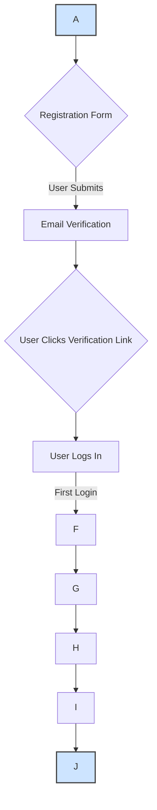

# **AdGenius: User Dashboard & Experience Design**

This document outlines the user experience (UX) and interface design principles for the AdGenius platform. The goal is to create an intuitive, efficient, and empowering dashboard that enables users of all skill levels to harness the power of generative AI for their advertising needs.

## **Section 1: Design Philosophy & Core Principles**

The AdGenius dashboard is the user's mission control for creating, managing, and analyzing ad campaigns. The design will be guided by the following principles:

- **Clarity and Focus:** The interface will prioritize essential information, using a clean layout and clear visual hierarchy to guide the user's attention to what matters most. Key Performance Indicators (KPIs) will be prominent and easy to understand at a glance.\[11, 12, 24\]
- **Actionability:** The dashboard is not just for viewing data; it's for making decisions. Every data point and visualization will be designed to prompt action, whether it's refining a prompt, launching a new A/B test, or reallocating a budget.
- **Tell a Story with Data:** The layout will be organized to guide the user through a logical narrative, from a high-level overview of performance down to the specific details of individual ad creatives. This helps users connect outcomes to specific marketing activities.\[25\]
- **Empowerment through Self-Service:** The dashboard will be highly interactive, with filters, drill-downs, and explorable charts. This empowers marketers to answer their own questions and discover insights without needing to run custom reports.

## **Section 2: Core User Flows**

User flow diagrams are essential for mapping out the user's journey to complete key tasks, ensuring a logical and frictionless experience.

### **2.1 New Tenant Onboarding and Setup**

This flow is a new user's first interaction with the product and is crucial for driving activation and demonstrating value quickly (the "Aha\! moment").

- **Entry Point:** User clicks "Sign Up" from the marketing landing page.\[13\]
- **Step 1 (Registration):** A simple registration form asks for minimal information: Name, Company Name, Email, and Password to reduce initial friction.
- **Step 2 (Email Verification):** An email is sent to the user with a verification link. The UI informs the user to check their inbox.
- **Step 3 (Login):** After verification, the user logs in for the first time.
- **Step 4 (Onboarding Wizard):** A multi-step modal guides the user through initial setup \[13\]:
  - **Welcome Screen:** A personalized welcome message.
  - **Brand Profile:** Prompts the user to enter core brand information: brand name, a brief description of the product/service, and target audience. This data will be used to prime the AI for generating on-brand content.
  - **Brand Voice:** Asks the user to select keywords that describe their brand's tone (e.g., "Formal," "Playful," "Inspirational").
  - **Connect Platforms (Optional):** Offers to connect to advertising platforms (e.g., Google Ads, Meta) for future performance tracking. This step can be skipped.
- **End Point:** The user lands on the main dashboard, which may feature a welcome checklist or tooltips pointing to key features like the ad generator.

### **2.2 First Ad Creative Generation**

This flow represents the core value proposition of the platform. It must be simple, intuitive, and deliver impressive results on the first try.

- **Entry Point:** User clicks "Create New Ad" from the dashboard.
- **Step 1 (Campaign Selection):** User either selects an existing campaign or creates a new one by providing a name and objective.
- **Step 2 (Generator Interface):** The user is presented with the main ad generator UI.
  - **Creative Type:** User selects the type of creative to generate (e.g., Image, Video, Slogan).
  - **Prompt Input:** A large text area for the user to describe their creative vision. Helper text and examples are provided.
  - **Advanced Options:** Collapsible sections for specifying tone, style, target audience, and aspect ratio. These fields are pre-populated from the onboarding data but can be overridden.
- **Step 3 (Generation):** User clicks "Generate." The UI shows a loading state. For long-running tasks like video generation, the UI will indicate that the task is running in the background and the user will be notified upon completion.
- **Step 4 (Review and Refine):** The generated creative(s) are displayed in a gallery view.
  - **Decision:** Does the user like the result?
  - **Path A (Yes):** User can save the creative to their campaign, download it, or proceed to deploy it.
  - **Path B (No):** User can refine their prompt and regenerate, or select a result and ask for variations (e.g., "make it more colorful," "try a different headline").
- **End Point:** A high-quality ad creative is saved to the user's campaign library, ready for use.

## **Section 3: Dashboard Wireframe Concepts & Layout**

Wireframes provide a low-fidelity blueprint for the UI layout and information architecture, focusing on functionality over visual design. Tools like **Figma**, **Balsamiq**, or **Miro** will be used for their creation.

### **3.1 Main Dashboard (Mission Control)**

- **Layout:** A classic dashboard layout with a persistent left sidebar for navigation and a main content area.
- **Information Hierarchy:** The layout will follow the "F" and "Z" reading patterns, placing the most critical information at the top and left.\[11\]
- **Top KPI Bar:** A prominent, full-width bar at the top of the page displaying the most critical, at-a-glance metrics:
  - Overall Return on Ad Spend (ROAS)
  - Total Conversions
  - Customer Acquisition Cost (CAC)
  - Total Spend
- **Main Content Area:** A series of data visualization "cards."
  - **Performance Over Time:** A large line chart showing key metrics (e.g., Clicks, Conversions) over a selectable date range.
  - **Top Performing Campaigns:** A list or bar chart showing the top 5 campaigns by ROAS or conversions.
  - **Recent Activity:** A feed showing recently generated creatives and their status.
  - **Quick Actions:** Buttons for "Create New Campaign" and "Generate New Creative."

### **3.2 Creative Generation Screen**

- **Layout:** A two-column layout for an efficient workflow.
- **Left Column (Controls):** Contains all user inputs.
  - A prominent text area for the main prompt.
  - Accordions for "Creative Type," "Style & Tone," "Target Audience," and "Format Options" (e.g., image aspect ratio).
  - A large "Generate" button at the bottom.
- **Right Column (Results):** A large, initially empty area that will display the generated creatives in a grid or carousel format. Each creative will have actions for "Save," "Download," and "Get Variations."

### **3.3 Campaign Detail / Analytics Screen**

- **Layout:** A detailed view focused on a single campaign.
- **Header:** Displays the campaign name, date range filter, and a primary call-to-action button: "+ New Creative."
- **KPI Section:** A row of cards displaying KPIs specific to this campaign (e.g., Campaign Spend, CTR, Conversion Rate).\[13\]
- **Creative Performance Grid:** A grid view of all creatives within the campaign. Each creative is represented by a card showing a thumbnail, its name, and key metrics. Clicking a card navigates to a detailed view for that specific creative.
- **Charts:**
  - A line chart showing performance over time (e.g., clicks per day).
  - A bar chart comparing the performance of the top creatives within the campaign.

## **Section 4: Key Performance Indicators (KPIs) and Visualizations**

The dashboard will track and visualize metrics that are essential for marketers to measure success and optimize campaigns.

| KPI Category            | Metrics                                                                                    | Recommended Visualization                              |
| :---------------------- | :----------------------------------------------------------------------------------------- | :----------------------------------------------------- |
| **Overall Performance** | Return on Ad Spend (ROAS), Customer Acquisition Cost (CAC), Total Conversions, Total Spend | Big Number Cards, Gauges                               |
| **Engagement**          | Click-Through Rate (CTR), Impressions, Clicks, Cost Per Click (CPC), Sessions              | Line Charts (for trends), Bar Charts (for comparisons) |
| **Conversion**          | Conversion Rate, Cost Per Conversion, Total Revenue                                        | Funnel Charts, Bar Charts                              |
| **Audience**            | Demographics, Top Performing Segments, Geographic Performance                              | Maps, Pie/Donut Charts                                 |

## **Section 5: Interactive Elements**

To enable self-service analytics, the dashboard will include several interactive elements:

- **Global Date Range Filter:** Allows users to view data for specific periods (e.g., Last 7 Days, Last 30 Days, Custom Range).
- **Drill-Downs:** Users can click on a campaign in the main dashboard to navigate to the detailed campaign analytics screen.
- **Hover-Over Tooltips:** Charts and graphs will have tooltips that provide more detailed information on hover.
- **Filtering and Sorting:** Data tables (e.g., the list of creatives in a campaign) will be filterable and sortable by various metrics.
