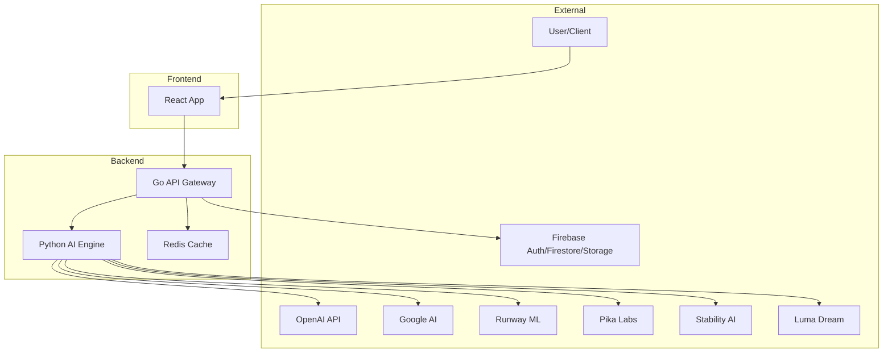
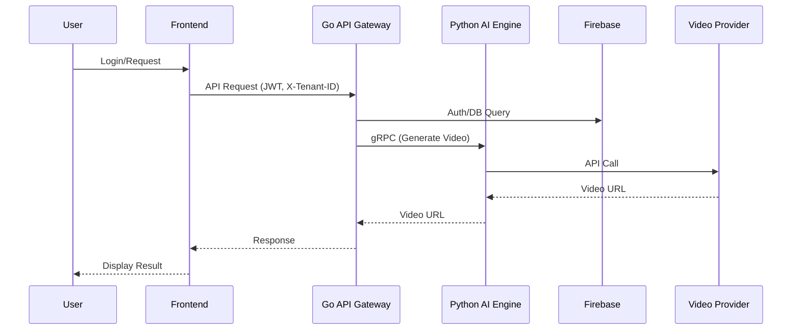
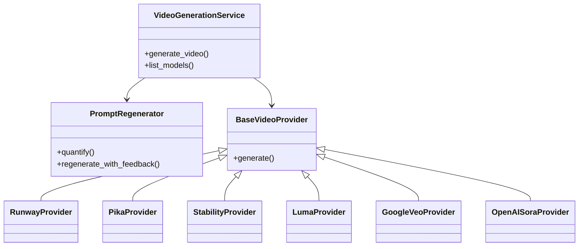
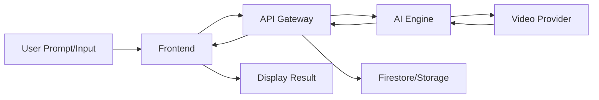
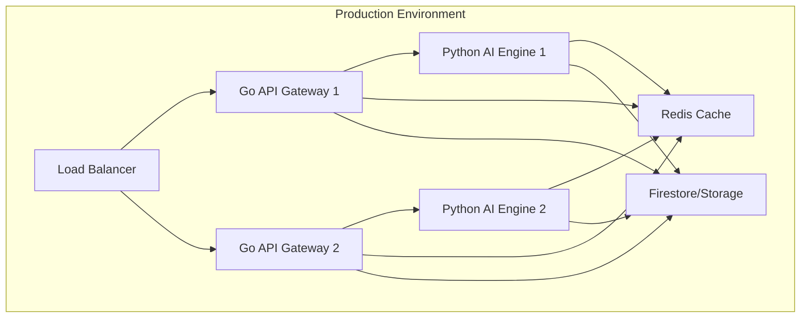

# 📋 Technical Design Document: ceaser-advt-genie

## 1. 🚀 Project Overview

- **Purpose**: CeaserAdvtGenius is a multi-tenant, AI-powered advertising platform that automates the generation of creative content (text, image, video) and provides analytics for digital marketing campaigns. It enables businesses to rapidly create, manage, and optimize ad creatives using state-of-the-art generative AI models.
- **Target Audience**: Marketing teams, digital agencies, SMBs, and enterprise users seeking scalable, automated ad creative generation and campaign analytics.
- **Key Features**:
  1. Multi-provider video generation (Runway, Pika, Stability, Luma, Google Veo, OpenAI Sora)
  2. AI-powered creative generation (text, image, video) with prompt quantification
  3. Multi-tenant campaign and creative management
  4. Real-time analytics and reporting
  5. Subscription billing and usage tracking
- **Technology Stack**:
  - **Languages**: Go (API Gateway), Python (AI Engine), TypeScript (React Frontend)
  - **Frameworks/Libraries**: LangChain, structlog, Material-UI, Vite, Gorilla Mux
  - **Databases**: Firebase Firestore
  - **External Services**: OpenAI, Google AI, Runway, Pika, Stability, Luma, Firebase Auth, Redis
- **Project Type**: Polyglot microservices SaaS platform (Web API, AI Engine, Frontend)

## 2. 🏗️ System Architecture

### 2.1 High-Level Architecture

- **Component Interaction**: React frontend communicates with Go API Gateway (REST). Go API Gateway orchestrates business logic, manages tenants, and delegates AI tasks to Python AI Engine (gRPC). Both services interact with Firebase (Firestore, Auth, Storage) and Redis for caching.
- **External Integrations**: OpenAI, Google AI, Runway, Pika, Stability, Luma for creative generation; Firebase for auth and data; Redis for caching.
- **Persistence Layer**: Firestore (multi-tenant collections), Firebase Storage (media), Redis (cache).
- **Authentication/Authorization**: Firebase Auth (frontend), JWT (API Gateway), tenant context extraction middleware, role-based access control.

### 2.2 Low-Level Architecture

- **Module Structure**:
  - `frontend/`: React app (components, pages, hooks, services, store, theme)
  - `services/go-api-gateway/`: Go microservice (handlers, services, middleware, models, proto)
  - `services/python-ai-engine/`: Python microservice (app/services, app/models, app/utils, proto)
- **Class Hierarchies**:
  - Python: `VideoGenerationService`, `PromptRegenerator`, provider adapters (inherit `BaseVideoProvider`)
  - Go: Service structs for tenants, campaigns, creatives, analytics, billing
- **Design Patterns**:
  - Adapter (video providers), Factory (creative generation), Middleware (Go), Service Layer (Go/Python), Dependency Injection (Go)
- **Code Organization**: Clear separation by domain, async/await in Python, context-based request handling in Go, TypeScript strict mode in frontend

## 3. 🔧 Core Functionality

### 3.1 Main Features

- **Video Generation**: Unified interface for generating videos via multiple providers. Input: prompt, model, duration, variations. Output: video URLs. Error handling: API key checks, provider fallback, async job polling.
- **Prompt Quantification**: LLM-powered service to structure and enhance user prompts. Input: free-form prompt. Output: structured parameters (duration, style, quality).
- **Creative Management**: CRUD for campaigns and creatives. Input: campaign/creative data. Output: persisted Firestore docs. Error handling: validation, tenant isolation.
- **Analytics**: Real-time campaign/creative analytics. Input: campaign/creative ID. Output: metrics (impressions, clicks, conversions).
- **Billing**: Subscription and usage tracking. Input: tenant/user actions. Output: invoices, usage reports.

### 3.2 API Endpoints

- **REST Endpoints (Go API Gateway)**:
  - `/api/v1/health` (GET): Health check
  - `/api/v1/auth/login` (POST): Login
  - `/api/v1/auth/register` (POST): Register
  - `/api/v1/campaigns` (GET/POST): List/create campaigns
  - `/api/v1/campaigns/{id}` (GET/PUT/DELETE): Get/update/delete campaign
  - `/api/v1/campaigns/{id}/creatives` (GET/POST): List/generate creatives
  - `/api/v1/creatives/{id}` (GET/PUT/DELETE): Get/update/delete creative
  - `/api/v1/video/models` (GET): List video models
  - `/api/v1/video/generate` (POST): Generate video
  - `/api/v1/analytics/campaigns/{id}` (GET): Campaign analytics
  - `/api/v1/analytics/creatives/{id}` (GET): Creative analytics
  - `/api/v1/analytics/overview` (GET): Dashboard analytics
- **gRPC Endpoints (Python AI Engine)**:
  - `GenerateVideo`, `ListVideoModels`, `QuantifyPrompt`, etc.
- **Authentication**: JWT required for all endpoints except health/auth. `X-Tenant-ID` header for multi-tenancy.
- **Validation**: Request body validation, tenant context checks, API key presence for providers.

### 3.3 Database Design

- **Type**: NoSQL (Firestore)
- **Schema**:
  - `tenants/{tenantId}`: Tenant metadata
  - `tenants/{tenantId}/campaigns/{campaignId}`: Campaigns
  - `tenants/{tenantId}/creatives/{creativeId}`: Creatives
  - `tenants/{tenantId}/analytics/{date}`: Analytics
- **Relationships**: Tenant → Campaigns → Creatives; Analytics linked by campaign/creative ID
- **Indexes**: Firestore composite indexes for queries on tenant/campaign/creative

## 4. 🔗 Module Interconnections

- **Frontend ↔ Go API Gateway**: REST/JSON
- **Go API Gateway ↔ Python AI Engine**: gRPC
- **Go API Gateway ↔ Firestore/Redis**: SDKs
- **Python AI Engine ↔ Providers**: HTTP APIs (OpenAI, Google, etc.)
- **Data Flow**: User → Frontend → API Gateway → (AI Engine/Firestore/Redis) → Response
- **Dependency Injection**: Go services use DI for handlers/services; Python uses provider registry

## 5. 📡 Message Queues & Communication

- **Redis**: Used for caching, not as a message broker
- **Async Processing**: Video generation jobs may be async (provider-dependent), but no explicit message queue (Kafka/RabbitMQ) in codebase
- **Event-Driven**: Not primary, but async job polling for video providers

## 6. 🛡️ Security & Performance

- **Authentication**: Firebase Auth (frontend), JWT (API Gateway), tenant context middleware
- **Authorization**: Role-based access, tenant isolation
- **Encryption**: HTTPS for all external/internal comms, Firestore encryption at rest
- **Performance**: Redis caching, async/await in Python, Go concurrency, Dockerized services
- **Monitoring/Logging**: structlog (Python), Go logging, health endpoints, error handling with tracebacks

## 7. 🚀 Deployment & Infrastructure

- **Deployment**: Docker Compose for local/dev, Makefile automation, production-ready Dockerfiles
- **Orchestration**: Docker Compose (Kubernetes migration planned)
- **CI/CD**: Not explicit, but Makefile targets for build/test/deploy
- **Infra as Code**: Not present, but Docker/Makefile for reproducibility

## 8. 📊 Technical Diagrams

### 8.1 System Architecture Diagram

### 8.2 Sequence Diagram (Main User Flow)

### 8.3 Class Diagram (Core Classes)

### 8.4 Data Flow Diagram

### 8.5 Deployment Diagram

## 9. 🔍 Code Quality & Best Practices

- **Structure**: Domain-driven, clear separation of concerns, async/await, context-based request handling
- **Testing**: Unit tests (Go, Python), integration tests (Postman), E2E via Makefile
- **Docs**: Centralized in `DEVELOPER_DOCUMENTATION.md`, API docs in `docs/`, architecture in `docs/ThoughtOfProject/`
- **Code Review**: PR-based workflow, code standards (PEP8, GoFmt, TypeScript strict)

## 10. 🚧 Future Considerations

- **Scalability**: Kubernetes migration, horizontal scaling, async job queues
- **Technical Debt**: Monitoring, security scanning, test coverage >90%
- **Feature Roadmap**: Advanced analytics, custom AI model training, A/B testing, third-party ad platform integrations
- **Performance**: Further caching, model optimization, CDN for media

---

_Generated from actual source code and configuration as of August 12, 2025. For details, see `DEVELOPER_DOCUMENTATION.md` and `docs/ThoughtOfProject/`._
