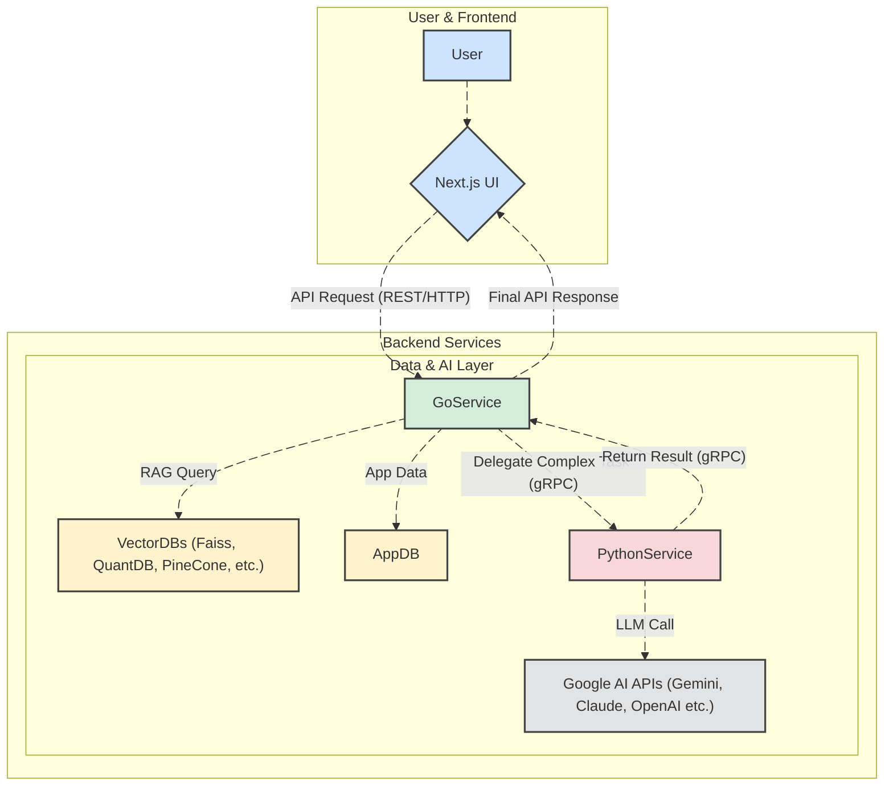

# **Go for AI Backends: A Performance-First Approach for RAG and LangChain Systems**

### **Executive Summary: The Verdict on Go for AI Backends**

Go is not just a good fit but is arguably the optimal choice for the high-performance, IO-bound, and concurrent operational plane of a modern AI backend. However, its current ecosystem maturity, particularly in the LangChainGo framework, necessitates a pragmatic architectural approach. The answer is a resounding "yes," but this is best realized through a **polyglot microservices architecture** where Go handles the core API and data orchestration, while Python is reserved for specialized, logic-intensive AI tasks.

- **Performance & Concurrency:** Go's inherent advantages in concurrency (goroutines), low memory footprint, and compiled speed make it vastly superior for handling the high volume of concurrent requests and I/O operations characteristic of Retrieval-Augmented Generation (RAG) systems.1
- **Ecosystem Maturity:** The primary trade-off is the AI ecosystem. Python's LangChain is a mature, feature-rich giant, while LangChainGo is a capable but still-developing port. For complex, agentic workflows with a wide variety of tools, Python retains a significant edge.3
- **Architectural Imperative:** A pure Go backend is viable for simpler RAG applications. However, for complex systems, a polyglot architecture using gRPC for communication between Go and Python services offers the best of both worlds: Go's performance for the serving layer and Python's rich AI libraries for the reasoning layer.8
- **Production Readiness:** Go's static binaries, fast startup times, and strong typing make it a superior choice for stable, maintainable, and cost-effective production deployments in containerized environments like Kubernetes.11

## **Part 1: The Foundational Conflict: Performance vs. Ecosystem**

The decision of which backend language to use for an AI application is driven by a central tension between runtime performance and the maturity of the AI development ecosystem. An application with high consumption of RAG and LangChain features sits directly at this intersection, requiring both low-latency, high-concurrency request handling and access to a rich set of AI tools and libraries.

### **Go: Engineered for Performance and Concurrency**

Go is a compiled, statically typed language designed by Google with a primary focus on building scalable and high-performance software, particularly for cloud-native and networked systems.12 Its suitability for the operational backend of an AI system stems from several core characteristics.

First, as a compiled language, Go code is translated directly into machine code, which results in significantly faster execution compared to interpreted languages like Python. Benchmarks consistently demonstrate that Go can be 10 to 100 times faster in CPU-bound tasks, a critical advantage for any performance-sensitive application.14 This raw speed translates to lower latency for API responses, which is a crucial factor in user-facing AI products.

The most significant advantage for an AI backend, however, is Go's native concurrency model. A RAG system is fundamentally I/O-bound, concurrently making network calls to a vector database, a Large Language Model (LLM) API, and potentially other data sources. Go's goroutines are extremely lightweight threads (requiring only a few kilobytes of memory) that are managed by the Go runtime, allowing a single application to handle thousands or even millions of concurrent operations efficiently.1 This is a stark contrast to Python, where the Global Interpreter Lock (GIL) in the standard CPython implementation prevents true parallelism for CPU-bound tasks and introduces overhead for I/O-bound tasks, making it less efficient at handling high-concurrency loads.1 For a high-consumption RAG system, Go's superior concurrency model leads directly to better scalability and lower infrastructure costs.

Finally, Go's static type system and straightforward error handling enforce a level of code discipline that is invaluable in production. Type errors are caught at compile time, not at runtime, which leads to more robust and maintainable codebases, a key requirement for enterprise-grade applications.11 The result is a single, statically linked binary with no external dependencies, which simplifies deployment and is perfectly suited for containerized environments.11

### **Python: The Undisputed King of the AI/ML Ecosystem**

While Go excels in performance, Python's dominance in the AI and machine learning landscape is absolute and built on an ecosystem of unparalleled breadth and maturity.3 This ecosystem is Python's primary advantage and the reason it is the default choice for most AI development.

Python offers a vast collection of libraries that are the industry standard for AI, including PyTorch and TensorFlow for model development, NumPy and pandas for data manipulation, and Hugging Face Transformers for accessing state-of-the-art models.21 This means that the latest research and cutting-edge techniques are almost always available first in Python, giving developers immediate access to innovation.

For building LLM applications, Python's LangChain framework is a mature, feature-rich juggernaut.5 It provides a comprehensive suite of tools, integrations, and pre-built components that vastly accelerate development. The Python version of LangChain has a massive number of integrations for external tools (like web search and code interpreters), agentic frameworks, and data loaders that are not yet available in its Go counterpart.6 This rich ecosystem, combined with Python's simple and readable syntax, allows data scientists and ML engineers to rapidly prototype, experiment, and iterate on complex AI logic, such as multi-step RAG chains and autonomous agents, at a speed that is currently unmatched in Go.1

The choice between Go and Python for an AI backend, therefore, presents a classic architectural trade-off. Go is optimized for the **runtime performance** of the application, offering superior speed, concurrency, and production stability. Python, conversely, is optimized for **development velocity and feature richness**, providing unparalleled access to the AI ecosystem. A system with high RAG consumption requires both low-latency responses and sophisticated AI logic, suggesting that an architecture choosing only one of these languages will be forced into a significant compromise. This points toward a hybrid approach, where the strengths of each language can be leveraged without inheriting all of their respective weaknesses.

#### **Comparative Analysis: Go vs. Python for AI Backend Workloads**

| Feature                                | Go (Golang)                                                                                                                                                    | Python                                                                                                                                                             |
| :------------------------------------- | :------------------------------------------------------------------------------------------------------------------------------------------------------------- | :----------------------------------------------------------------------------------------------------------------------------------------------------------------- |
| **Performance (Execution Speed)**      | **Excellent.** Compiled to native machine code. Benchmarks show 10-100x faster execution for CPU-bound tasks.14                                                | **Fair.** Interpreted language with significant overhead. Relies on C/C++ libraries (e.g., NumPy) for performance in specific domains.21                           |
| **Concurrency Handling**               | **Excellent.** Built-in, lightweight goroutines and channels designed for high-concurrency I/O-bound and parallel CPU-bound tasks.1                            | **Poor to Fair.** Hampered by the Global Interpreter Lock (GIL), limiting true parallelism in a single process. asyncio is effective for I/O but adds complexity.1 |
| **Memory Footprint**                   | **Low.** Efficient memory management and smaller binaries make it ideal for containerized/microservice deployments.11                                          | **High.** Dynamic typing and the interpreter result in higher memory consumption per process.14                                                                    |
| **AI/ML Ecosystem Maturity**           | **Emerging.** LangChainGo is a promising port but lacks the breadth of integrations and tools of its Python counterpart.4 Fewer specialized AI/ML libraries.24 | **Mature & Dominant.** The de facto standard. Unparalleled ecosystem with LangChain, PyTorch, TensorFlow, Hugging Face, etc..3                                     |
| **Developer Experience (Prototyping)** | **Good.** Simple syntax but stricter typing and less "magic" can slow down initial experimentation compared to Python.                                         | **Excellent.** Highly readable syntax and vast libraries enable extremely rapid prototyping and iteration.1                                                        |
| **Developer Experience (Production)**  | **Excellent.** Static typing, fast compilation, and single-binary deployments lead to more reliable, maintainable, and easy-to-operate systems at scale.11     | **Good.** Dynamic typing can lead to runtime errors. Dependency management and deployment can be more complex ("dependency hell").25                               |
| **Best Fit in AI Backend**             | **Operational Plane:** API gateways, service orchestration, high-throughput data ingestion, and low-latency RAG retrieval.                                     | **Reasoning/Experimental Plane:** Complex agentic logic, data science workflows, model training/prototyping, tasks requiring specialized libraries.                |

## **Part 2: A Deep Dive into LangChainGo: The Go AI Application Framework**

LangChainGo is a community-driven port of the popular Python LangChain framework, aiming to enable Go developers to build LLM-powered applications with the same principles of composability and modularity.26 A thorough evaluation of its components, integrations, and overall maturity is essential to determine its fitness for a production AI backend.

### **Core Components and Abstractions**

LangChainGo successfully mirrors the core architecture of its Python parent, providing a standard interface for the essential components of an LLM application.23 The framework is organized into several key packages that provide the necessary abstractions:

- **LLMs and Chat Models:** The llms package offers a standardized interface for interacting with various language models. Crucially, it includes robust support for Google's Gemini models through the llms/googleai package, which can be configured to use either a standard API key or authenticate via a GCP project with Vertex AI. This flexibility is a significant advantage for developers building on Google's ecosystem.28
- **Data Connection:** This is the heart of any RAG system. LangChainGo provides the necessary components, including document loaders, text splitters, and vector store integrations. The framework has native support for several key vector databases, most notably **Qdrant** and **MongoDB Atlas Vector Search**, which are critical for building high-performance retrieval systems.30
- **Chains and Memory:** The chains and memory packages provide the logic for sequencing LLM calls and other components, as well as for persisting conversational history. These are fundamental for building anything from simple Q\&A bots to more complex, stateful applications.23

### **The RAG Toolchain in Go: Is it Complete?**

For a standard RAG application, the workflow is a deterministic chain of events: a user query is used to retrieve relevant documents from a knowledge base, and those documents are then passed to an LLM along with the original query to generate a contextually grounded answer.

An analysis of LangChainGo's components and examples confirms that a complete, production-ready RAG pipeline can be built entirely in Go.26 The necessary building blocks are all present:

1. **Document Loaders** to ingest data from sources.
2. **Text Splitters** to chunk large documents.
3. **Embedders** to convert text chunks into vector embeddings, with support for models from OpenAI, Ollama, and Gemini.28
4. **Vector Stores** to index and retrieve these embeddings. The native Qdrant integration (vectorstores/qdrant) provides the essential functionality to add documents and perform similarity searches.31 While the documentation for the Go integration is less exhaustive than Python's, the core capabilities are functional. However, advanced features like hybrid search or complex metadata filtering, which are well-supported in Qdrant itself, may not be exposed through high-level LangChainGo abstractions and could require direct use of the Qdrant Go SDK.

### **The Agent and Tool Ecosystem: The Maturity Gap**

While LangChainGo is well-equipped for building structured chains like RAG, its capabilities for building more dynamic, "agentic" systems reveal a significant maturity gap compared to the Python ecosystem. Agents use an LLM not just to answer questions, but as a reasoning engine to decide which "tool" to use to accomplish a task. A tool can be anything from a web search to a database query or an API call.7

The Python LangChain ecosystem offers a vast arsenal of hundreds of pre-built tools and toolkits, enabling agents to interact with a wide array of external systems like AWS, Azure, GitHub, and various web browsing services with minimal setup.6 This rich ecosystem is what makes building powerful, autonomous agents in Python so compelling.

In contrast, LangChainGo provides the fundamental tools.Tool interface and a few basic implementations, such as a DuckDuckGo search tool and a web scraper.23 While developers can create custom tools by defining a

llms.FunctionDefinition struct, the burden of implementation falls entirely on them.36 There is no extensive library of pre-built integrations to draw from.

This leads to a critical distinction. A standard RAG pipeline is a deterministic chain, and LangChainGo has all the necessary components to build this efficiently and performantly. An agentic system, however, is non-deterministic; it must decide at runtime which tool to use based on the user's query. Building an agent that can choose between searching a Qdrant vector store, querying a SQL database, or browsing the web would be straightforward in Python using off-the-shelf tools. In Go, this would require significant custom development to create and integrate each of those tools, erasing much of the rapid development benefit that a framework like LangChain is supposed to provide.

Therefore, LangChainGo is production-ready and highly suitable for building high-performance, deterministic RAG applications. However, for complex, multi-tool agentic systems, it remains in an early-adopter phase, lagging considerably behind the feature-rich Python ecosystem.

## **Part 3: Architecting the Solution: Polyglot Microservices as the Gold Standard**

Given the trade-off between Go's performance and Python's mature AI ecosystem, the optimal architecture for a sophisticated AI backend is not a monolith built in a single language but a polyglot microservices system. This approach strategically assigns responsibilities to the language best suited for the task, a pattern successfully adopted by high-performance tech companies like Uber and Dropbox, which have notably migrated performance-critical services from Python to Go.37

### **Why a Monolith is a Trade-off**

A monolithic architecture, while simpler to deploy initially, forces a compromise. A **pure Go monolith** would be exceptionally performant, scalable, and easy to operate, making it an excellent choice for a dedicated RAG API service. However, it would face an "ecosystem wall" if the product roadmap includes complex agentic features, requiring substantial custom development to build tools that are readily available in Python.

Conversely, a **pure Python monolith** offers rapid development and full access to the AI ecosystem. This is ideal for prototyping and for applications where time-to-market is the highest priority. However, as consumption grows, it will inevitably face performance and scalability challenges due to Python's interpreted nature and the Global Interpreter Lock (GIL), leading to higher infrastructure costs and potential latency bottlenecks.1

### **The Polyglot Microservice Architecture: A Detailed Blueprint**

A polyglot microservice architecture resolves this dilemma by creating a clear separation of concerns, assigning each language to a distinct operational plane.

#### **Go Service(s) \- The "Operational Plane"**

The Go service acts as the robust, high-performance front door to the AI application. Its responsibilities are primarily operational and I/O-intensive, making it a perfect match for Go's strengths.

- **Core Functions:** This service handles all incoming API requests, user authentication, authorization, rate limiting, and request validation. It serves as the API Gateway for the entire system.
- **RAG Orchestration:** The Go service manages the core RAG workflow. Upon receiving a user query, it orchestrates the necessary I/O operations: generating an embedding for the query (if needed), making a high-concurrency call to the Qdrant vector store to retrieve relevant documents, and formatting the context payload. Go's goroutines are ideal for managing thousands of these concurrent, I/O-bound operations with minimal resource overhead.

#### **Python Service(s) \- The "Reasoning/AI Plane"**

The Python service is a specialized component that encapsulates complex AI logic, leveraging the mature Python ecosystem where LangChainGo is still developing.

- **Core Functions:** This service is responsible for tasks that require advanced agentic reasoning or rely on tools and libraries not readily available in Go. It does not handle direct user traffic but receives requests from the Go service.
- **Example Workflow:** A user asks a complex question like, "Summarize the key findings from my uploaded documents about project Alpha and then search the web for recent news on our main competitor."
  1. The **Go service** receives the request and retrieves the relevant documents from Qdrant.
  2. Recognizing that the request requires both summarization and an external web search (a tool not readily available in its toolkit), the Go service packages the retrieved documents and the follow-up task into a request.
  3. It sends this request to the **Python agent service** via gRPC.
  4. The Python service, using the full power of the Python LangChain library, invokes an LLM for summarization and then uses a pre-built web search tool to find recent news.
  5. The Python service returns the final, synthesized answer to the Go service, which then delivers it to the user.

#### **The Communication Protocol: Why gRPC is Essential**

For this architecture to function with low latency, the communication between the Go and Python services must be highly efficient. This is where gRPC is the essential choice over traditional REST/JSON APIs.

- **Performance:** gRPC utilizes HTTP/2 for multiplexing requests over a single connection and Protocol Buffers (Protobufs) for binary serialization. This combination is significantly faster and more network-efficient than text-based JSON over HTTP/1.1, which is critical for minimizing latency in a distributed system.8
- **Type Safety and Schema Evolution:** Protobufs act as a strongly-typed, language-agnostic contract between services. By defining the structure of requests and responses in a .proto file, code can be generated for both Go and Python, ensuring that the services communicate seamlessly and eliminating a common source of runtime errors. Managing the evolution of these schemas is critical. Best practices, such as never reusing field tag numbers and using tools like Buf for automated breaking-change detection in CI/CD pipelines, ensure that services can be updated independently without causing system-wide failures.39

This architectural pattern is more than just a technical solution; it is a strategic approach to organizing development efforts. It allows an organization to form specialized teams: a backend/infrastructure team focused on building highly scalable and reliable services in Go, and an AI/ML team focused on rapid experimentation and leveraging the latest AI advancements in Python. The gRPC and Protobuf contract becomes the formal interface between these two teams, enabling them to work in parallel and innovate faster. This decoupling accelerates both the productionalization of stable features and the exploration of new AI capabilities.

## **Part 4: Implementation and Operational Considerations**

Successfully implementing and operating a polyglot microservices architecture requires careful consideration of the tooling for development, deployment, and monitoring.

### **Choosing Your Go Web Framework**

For the Go service that acts as the API gateway and orchestrator, a minimalist, high-performance web framework is ideal. The Go ecosystem offers several excellent choices, including **Gin**, **Echo**, and **Chi**. All three are known for their speed, simplicity, and robust middleware support.36

- **Gin:** The most popular Go framework, known for its Martini-like API and excellent performance.
- **Echo:** A minimalist framework that is highly extensible and focuses on performance and a concise API.
- **Chi:** A lightweight and composable router that is particularly well-regarded for its adherence to standard net/http interfaces, making it highly compatible with the broader Go ecosystem.9

The choice between them often comes down to developer preference regarding API design and middleware implementation. For the purpose of building a high-throughput API layer for an AI application, any of these frameworks represents a solid, production-ready choice.

### **Building a Polyglot CI/CD Pipeline**

A robust CI/CD pipeline is critical for managing the complexity of a polyglot architecture. The pipeline must be able to build, test, and deploy services written in different languages independently.

- **Repository Structure:** A monorepo, where both Go and Python services reside in the same repository, can simplify dependency management and atomic cross-service changes. However, this requires CI/CD tooling capable of selectively building and deploying only the services that have changed, based on file paths.47
- **Containerization:** Each microservice should be containerized using Docker. Multi-stage Dockerfiles are a best practice, allowing for the creation of small, secure, and efficient production images by separating the build environment from the runtime environment.48
- **Automated Testing:** The pipeline must automate testing for each service in its native language. This includes unit tests, integration tests, and contract testing for the gRPC interfaces. Integration testing gRPC services often involves spinning up mock servers or temporary instances of dependent services to validate the communication layer.50
- **Schema Management:** Any changes to the .proto files that define the gRPC contracts must be automatically validated to prevent breaking changes. Tools like Buf can be integrated directly into the CI pipeline to compare schema changes against the main branch or a schema registry, failing the build if a breaking change is detected.43

### **Observability in a Distributed AI System**

In a distributed system, understanding the lifecycle of a request is paramount for debugging and performance tuning. When a user's query is slow, it is essential to determine whether the bottleneck is in the Go API gateway, the Qdrant query, the gRPC call to the Python service, or the LLM generation itself.

- **Distributed Tracing:** This is a non-negotiable requirement. A distributed tracing solution is needed to follow a single request as it propagates across multiple services.
- **OpenTelemetry:** The industry standard for observability is OpenTelemetry. By instrumenting both the Go and Python services with OpenTelemetry SDKs, a consistent trace context can be propagated across the gRPC calls. This allows tracing tools like Jaeger, Grafana Tempo, or Datadog to visualize the entire request flow as a single, unified trace, providing detailed latency breakdowns for each step in the process.53

## **Part 5: Conclusion and Final Recommendation**

The decision to use Go for an AI application backend hinges on a clear understanding of its strengths and the current state of its AI ecosystem. Go's design offers unparalleled performance, concurrency, and operational efficiency, making it an ideal foundation for the high-throughput, low-latency demands of a production RAG system. Its lightweight nature and simple deployment model are perfectly aligned with modern cloud-native and microservice architectures.

However, the primary constraint is the relative immaturity of its AI tooling ecosystem compared to Python. While LangChainGo provides a solid and growing foundation for building LLM applications, particularly for deterministic RAG pipelines, it cannot yet match the sheer breadth of tools, integrations, and agentic frameworks available in Python's LangChain. Building complex, multi-tool agents in Go currently requires significant custom development, undermining the goal of rapid iteration that is crucial in the AI space.

Therefore, the most effective and future-proof strategy is not to choose one language over the other, but to leverage the strengths of both in a well-architected polyglot system.

**Final Recommendation:** For any production-grade AI application with high consumption of RAG and LangChain functionalities, **Go should be the primary language for the backend's operational plane**. This includes the API gateway, request handling, and the core orchestration of RAG retrieval from vector databases like Qdrant. For complex, non-deterministic reasoning and tasks that require the extensive toolset of the mature LangChain ecosystem, these responsibilities should be delegated to a dedicated **Python microservice, communicating with the Go backend via a high-performance gRPC interface.**

This hybrid architecture is not a compromise; it is a strategic design that aligns the best tool for each specific job. It creates a system that is both highly performant and scalable at its core (thanks to Go) and deeply intelligent and adaptable at its reasoning layer (thanks to Python). This approach enables organizational specialization, accelerates both production stability and AI innovation, and represents the most robust path forward for building sophisticated, enterprise-ready AI applications.

#### **Works cited**

1. Golang vs Python: Which Language Should You Choose? \- CodePorting, accessed August 2, 2025, [https://www.codeporting.com/blog/golang_vs_python_which_language_should_you_choose](https://www.codeporting.com/blog/golang_vs_python_which_language_should_you_choose)
2. Go vs Python for File Processing: A Performance and Architecture Perspective, accessed August 2, 2025, [https://dev.to/nicobistolfi/go-vs-python-for-file-processing-a-performance-and-architecture-perspective-2pa4](https://dev.to/nicobistolfi/go-vs-python-for-file-processing-a-performance-and-architecture-perspective-2pa4)
3. Python vs Golang: Which Language Should Your Business · SoCode, accessed August 2, 2025, [https://www.socode.co.uk/blog/2024/09/python-vs-golang-which-language-should-your-business-prioritise](https://www.socode.co.uk/blog/2024/09/python-vs-golang-which-language-should-your-business-prioritise)
4. Langchaingo feedbacks : r/golang \- Reddit, accessed August 2, 2025, [https://www.reddit.com/r/golang/comments/1af94w1/langchaingo_feedbacks/](https://www.reddit.com/r/golang/comments/1af94w1/langchaingo_feedbacks/)
5. Towards LangChain 0.1: LangChain-Core and LangChain-Community \- LangChain Blog, accessed August 2, 2025, [https://blog.langchain.com/the-new-langchain-architecture-langchain-core-v0-1-langchain-community-and-a-path-to-langchain-v0-1/](https://blog.langchain.com/the-new-langchain-architecture-langchain-core-v0-1-langchain-community-and-a-path-to-langchain-v0-1/)
6. Tools | 🦜️ LangChain, accessed August 2, 2025, [https://python.langchain.com/docs/integrations/tools/](https://python.langchain.com/docs/integrations/tools/)
7. Understanding LangChain Tools and Agents: A Guide to Building Smart AI Applications, accessed August 2, 2025, [https://medium.com/@Shamimw/understanding-langchain-tools-and-agents-a-guide-to-building-smart-ai-applications-e81d200b3c12](https://medium.com/@Shamimw/understanding-langchain-tools-and-agents-a-guide-to-building-smart-ai-applications-e81d200b3c12)
8. gRPC, accessed August 2, 2025, [https://grpc.io/](https://grpc.io/)
9. Python and Go : Part I \- gRPC \- Ardan Labs, accessed August 2, 2025, [https://www.ardanlabs.com/blog/2020/06/python-go-grpc.html](https://www.ardanlabs.com/blog/2020/06/python-go-grpc.html)
10. Building a Polyglot Microservices Note App: The Power of Polyglot Architecture, accessed August 2, 2025, [https://techieemma.medium.com/building-a-polyglot-microservices-notes-app-the-power-of-polyglot-architecture-e93389658848](https://techieemma.medium.com/building-a-polyglot-microservices-notes-app-the-power-of-polyglot-architecture-e93389658848)
11. Go vs. Python: What's the difference, and is Go a good choice for system administration? : r/golang \- Reddit, accessed August 2, 2025, [https://www.reddit.com/r/golang/comments/16px62p/go_vs_python_whats_the_difference_and_is_go_a/](https://www.reddit.com/r/golang/comments/16px62p/go_vs_python_whats_the_difference_and_is_go_a/)
12. Go vs. Python: Performance, Use Cases, and Key Differences \- Rubyroid Labs, accessed August 2, 2025, [https://rubyroidlabs.com/blog/2024/09/go-vs-python/](https://rubyroidlabs.com/blog/2024/09/go-vs-python/)
13. LangChain Go \- DEV Community, accessed August 2, 2025, [https://dev.to/stefanalfbo/langchain-go-18m0](https://dev.to/stefanalfbo/langchain-go-18m0)
14. Golang Vs. Python Performance: Which Programming Language Is Better?, accessed August 2, 2025, [https://www.extwebtech.com/blog/golang-vs-python-performance/](https://www.extwebtech.com/blog/golang-vs-python-performance/)
15. Top 10 Golang Benchmarks That Will Blow Your Mind | by Tech In Focus \- Medium, accessed August 2, 2025, [https://medium.com/@techInFocus/top-10-golang-benchmarks-that-will-blow-your-mind-6e06df910ae8](https://medium.com/@techInFocus/top-10-golang-benchmarks-that-will-blow-your-mind-6e06df910ae8)
16. Go Performs 10x Faster Than Python : r/golang \- Reddit, accessed August 2, 2025, [https://www.reddit.com/r/golang/comments/1aq6zkv/go_performs_10x_faster_than_python/](https://www.reddit.com/r/golang/comments/1aq6zkv/go_performs_10x_faster_than_python/)
17. Go vs. Python: Web Service Performance | by Dmytro Misik \- Medium, accessed August 2, 2025, [https://medium.com/@dmytro.misik/go-vs-python-web-service-performance-1e5c16dbde76](https://medium.com/@dmytro.misik/go-vs-python-web-service-performance-1e5c16dbde76)
18. Should I migrate my Multithreading Python program to Golang or other languages \- Reddit, accessed August 2, 2025, [https://www.reddit.com/r/golang/comments/1bf36nv/should_i_migrate_my_multithreading_python_program/](https://www.reddit.com/r/golang/comments/1bf36nv/should_i_migrate_my_multithreading_python_program/)
19. Go vs Python: Pick the Language for Your Project | Guide 2025 \- Mobilunity, accessed August 2, 2025, [https://mobilunity.com/blog/golang-vs-python/](https://mobilunity.com/blog/golang-vs-python/)
20. Why Golang is the Top Choice for Cloud-Native Development \- Rubyroid Labs, accessed August 2, 2025, [https://rubyroidlabs.com/blog/2025/06/golang-is-the-top-choice-for-cloud-native-development/](https://rubyroidlabs.com/blog/2025/06/golang-is-the-top-choice-for-cloud-native-development/)
21. Go vs Python \- The Best Choice for Your Career in 2025 \- Brisk Tech Solutions, accessed August 2, 2025, [https://brisktechsol.com/go-vs-python/](https://brisktechsol.com/go-vs-python/)
22. Go vs Python for Backend: Head to Toe Comparison \- Bacancy Technology, accessed August 2, 2025, [https://www.bacancytechnology.com/blog/go-vs-python](https://www.bacancytechnology.com/blog/go-vs-python)
23. langchaingo package \- github.com/tmc/langchaingo \- Go Packages, accessed August 2, 2025, [https://pkg.go.dev/github.com/tmc/langchaingo](https://pkg.go.dev/github.com/tmc/langchaingo)
24. Golang vs Python for AI Solutions: How Do You Decide? \- Reddit, accessed August 2, 2025, [https://www.reddit.com/r/golang/comments/1hcjh6i/golang_vs_python_for_ai_solutions_how_do_you/](https://www.reddit.com/r/golang/comments/1hcjh6i/golang_vs_python_for_ai_solutions_how_do_you/)
25. Should I choose Golang or Python for backend development? \- Reddit, accessed August 2, 2025, [https://www.reddit.com/r/golang/comments/1e0oprs/should_i_choose_golang_or_python_for_backend/](https://www.reddit.com/r/golang/comments/1e0oprs/should_i_choose_golang_or_python_for_backend/)
26. Welcome to LangChainGo \- tmc, accessed August 2, 2025, [https://tmc.github.io/langchaingo/docs/](https://tmc.github.io/langchaingo/docs/)
27. tmc/langchaingo: LangChain for Go, the easiest way to write LLM-based programs in Go \- GitHub, accessed August 2, 2025, [https://github.com/tmc/langchaingo](https://github.com/tmc/langchaingo)
28. Using Gemini models in Go with LangChainGo \- Eli Bendersky's ..., accessed August 2, 2025, [https://eli.thegreenplace.net/2024/using-gemini-models-in-go-with-langchaingo/](https://eli.thegreenplace.net/2024/using-gemini-models-in-go-with-langchaingo/)
29. llms: Add Gemini Pro support \+ example · Issue \#410 · tmc/langchaingo \- GitHub, accessed August 2, 2025, [https://github.com/tmc/langchaingo/issues/410](https://github.com/tmc/langchaingo/issues/410)
30. LangChainGo and MongoDB: Powering RAG Applications in Go, accessed August 2, 2025, [https://www.mongodb.com/company/blog/langchaingo-mongodb-powering-rag-applications-in-go](https://www.mongodb.com/company/blog/langchaingo-mongodb-powering-rag-applications-in-go)
31. Langchain Go \- Qdrant, accessed August 2, 2025, [https://qdrant.tech/documentation/frameworks/langchain-go/](https://qdrant.tech/documentation/frameworks/langchain-go/)
32. Retrievers | 🦜️ LangChainGo \- tmc, accessed August 2, 2025, [https://tmc.github.io/langchaingo/docs/modules/data_connection/retrievers/](https://tmc.github.io/langchaingo/docs/modules/data_connection/retrievers/)
33. Building RAG systems in Go with Ent, Atlas, and pgvector, accessed August 2, 2025, [https://entgo.io/blog/2025/02/12/rag-with-ent-atlas-pgvector/](https://entgo.io/blog/2025/02/12/rag-with-ent-atlas-pgvector/)
34. StacklokLabs/gorag: GoRag: Go Interface for Augmented LLM retrieval \- GitHub, accessed August 2, 2025, [https://github.com/StacklokLabs/gorag](https://github.com/StacklokLabs/gorag)
35. Getting Started: Agent Executors | 🦜️ LangChainGo \- tmc, accessed August 2, 2025, [https://tmc.github.io/langchaingo/docs/modules/agents/executor/getting-started/](https://tmc.github.io/langchaingo/docs/modules/agents/executor/getting-started/)
36. Developing My First SRE Helper LLM Agent Using LangchainGo \- Medium, accessed August 2, 2025, [https://medium.com/learnings-from-the-paas/developing-my-first-sre-helper-llm-agent-using-langchaingo-63f4201636f5](https://medium.com/learnings-from-the-paas/developing-my-first-sre-helper-llm-agent-using-langchaingo-63f4201636f5)
37. How We Built Uber Engineering's Highest Query per Second Service Using Go, accessed August 2, 2025, [https://www.uber.com/blog/go-geofence-highest-query-per-second-service/](https://www.uber.com/blog/go-geofence-highest-query-per-second-service/)
38. Open Sourcing Our Go Libraries \- Dropbox Tech Blog, accessed August 2, 2025, [https://dropbox.tech/infrastructure/open-sourcing-our-go-libraries](https://dropbox.tech/infrastructure/open-sourcing-our-go-libraries)
39. Designing Evolvable Protobuf Schemas for Microservices \- Java Code Geeks, accessed August 2, 2025, [https://www.javacodegeeks.com/2025/07/designing-evolvable-protobuf-schemas-for-microservices.html](https://www.javacodegeeks.com/2025/07/designing-evolvable-protobuf-schemas-for-microservices.html)
40. Proto-Break: Safeguarding Your Protobuf Evolution | by Valentine Shevchenko | Medium, accessed August 2, 2025, [https://medium.com/@tedious/proto-break-safeguarding-your-protobuf-evolution-7b8455f08796](https://medium.com/@tedious/proto-break-safeguarding-your-protobuf-evolution-7b8455f08796)
41. Proto Best Practices | Protocol Buffers Documentation, accessed August 2, 2025, [https://protobuf.dev/best-practices/dos-donts/](https://protobuf.dev/best-practices/dos-donts/)
42. Language Guide (proto 3\) | Protocol Buffers Documentation, accessed August 2, 2025, [https://protobuf.dev/programming-guides/proto3/](https://protobuf.dev/programming-guides/proto3/)
43. Breaking change detection quickstart \- Buf, accessed August 2, 2025, [https://buf.build/docs/breaking/quickstart/](https://buf.build/docs/breaking/quickstart/)
44. Golang vs. Python — Which One to Choose? \- SoftKraft, accessed August 2, 2025, [https://www.softkraft.co/golang-vs-python/](https://www.softkraft.co/golang-vs-python/)
45. All About Netflix Artificial Intelligence: The Truth Behind Personalized Content \- Litslink, accessed August 2, 2025, [https://litslink.com/blog/all-about-netflix-artificial-intelligence-the-truth-behind-personalized-content](https://litslink.com/blog/all-about-netflix-artificial-intelligence-the-truth-behind-personalized-content)
46. Setting up Custom Tools and Agents in LangChain \- Analytics Vidhya, accessed August 2, 2025, [https://www.analyticsvidhya.com/blog/2024/10/setting-up-custom-tools-and-agents-in-langchain/](https://www.analyticsvidhya.com/blog/2024/10/setting-up-custom-tools-and-agents-in-langchain/)
47. What's everyone using for monorepos? : r/golang \- Reddit, accessed August 2, 2025, [https://www.reddit.com/r/golang/comments/170c6xc/whats_everyone_using_for_monorepos/](https://www.reddit.com/r/golang/comments/170c6xc/whats_everyone_using_for_monorepos/)
48. 5 Ways to Deploy Microservices \- Semaphore, accessed August 2, 2025, [https://semaphore.io/blog/deploy-microservices](https://semaphore.io/blog/deploy-microservices)
49. CI/CD for Microservices: Strategies and Challenges, accessed August 2, 2025, [https://www.nucamp.co/blog/coding-bootcamp-back-end-with-python-and-sql-cicd-for-microservices-strategies-and-challenges](https://www.nucamp.co/blog/coding-bootcamp-back-end-with-python-and-sql-cicd-for-microservices-strategies-and-challenges)
50. go \- Testing a gRPC service \- Stack Overflow, accessed August 2, 2025, [https://stackoverflow.com/questions/42102496/testing-a-grpc-service](https://stackoverflow.com/questions/42102496/testing-a-grpc-service)
51. dneprokos/GRPC-Integration-Testing-with-Python \- GitHub, accessed August 2, 2025, [https://github.com/dneprokos/GRPC-Integration-Testing-with-Python](https://github.com/dneprokos/GRPC-Integration-Testing-with-Python)
52. Detect breaking changes \- Buf Docs, accessed August 2, 2025, [https://buf.build/docs/breaking/](https://buf.build/docs/breaking/)
53. Distributed tracing with OpenTelemetry in your Go/Python microservices \- Adevinta, accessed August 2, 2025, [https://adevinta.com/techblog/distributed-tracing-with-opentelemetry-in-your-go-python-microservices/](https://adevinta.com/techblog/distributed-tracing-with-opentelemetry-in-your-go-python-microservices/)
